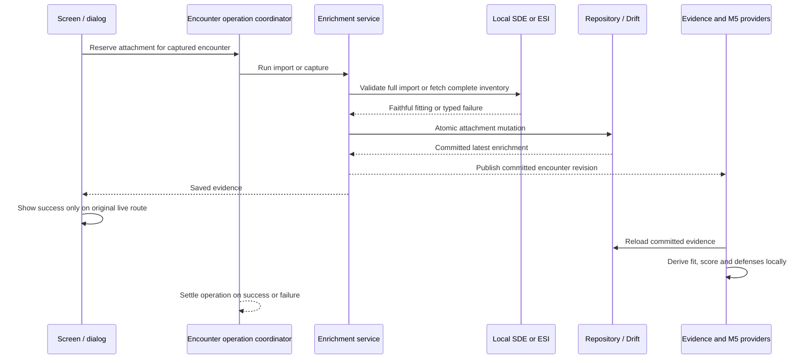

# AAR Fit Import and Capture UI Tests — Technical Architecture and Design

**Status.** Ready for implementation planning and RED tests; fixes and runtime validation pending.
**Author.** Technical Architect.
**Date.** 2026-09-15 (design work began 2026-09-14).
**Baseline.** `develop`, Product contract commit `e4821ce`.
**Authority.** [Product contract](aar-fit-import-capture-ui-tests.md), including its
24 acceptance criteria, 36 test cases, and exact feedback copy. This document defines
implementation seams and verification gates; it does not claim the defects are fixed.

## 1. Executive summary and architecture contracts

An attachment succeeds only when the complete supported fit has committed to the
original encounter, can be reloaded through real storage, refreshes live evidence and
defenses, and survives explicit re-analysis. Invalid input and failed capture/save
leave the previous evidence intact. A saved fit is not a promise of complete simulation
coverage or a regenerated report.

Implement three narrow corrections:

1. Select EFT by its header structure, not by whether the text contains a colon.
2. Add strict, faithful-content validation at the **AAR import boundary**, preserving
   the shared fitting parser's tolerant behavior for other callers.
3. Replace stale whole-enrichment service writes with atomic, field-owned repository
   mutations. Refresh, correlation backfill, and derived-ledger updates must retain
   attachments committed while those operations were awaiting other work.

Supporting Product contracts require encounter-scoped attachment coordination, an
analysis preparation barrier, typed feedback, qualified no-module capture, and safe
widget lifecycle handling. These are bounded extensions of the existing workflow,
not a new fitting editor, authentication flow, or generic job framework.

### 1.1 Invariants

| Contract | Required implementation behavior |
| --- | --- |
| Encounter ownership | Capture uses `encounter.characterId`; writes use the captured `encounter.id`. Never fall back to the globally selected character. |
| Faithful import | Every supplied nonblank, non-placeholder item is represented with the correct type, kind, slot, and quantity, or the entire import fails before writing. |
| Intentional absence | A known ship header with no modules is valid. Dropping unresolved supplied content is not equivalent to an intentional empty fit. |
| Evidence provenance | Manual import is pilot/manualFitImport/confirmed. Current capture is pilot/currentShipSnapshot/confirmed or reference according to the explicit service argument. Preserve UTC capture time and limitations. |
| Save boundary | No success message, live-provider publication, or score promise before the actual database commit. Failed writes retain the previous row. |
| Retention | Refresh is not permission to delete attached pilot or victim evidence. An older snapshot cannot replace a newer attachment. |
| Confidence separation | User confirmation, identity confidence, weapon coverage, and defense/skills derivation remain independent. Missing simulation attributes do not make a resolved textual item unknown. |
| Explicit analysis | Opening, attaching, expanding, and locally reloading do not call AI or discover killmails. Explicit analysis may use the existing discovery flow. |
| Historical report | Attachment does not edit cached AI prose or `evidenceAtGeneration`. Only successful explicit analysis replaces the report. |
| Concurrency | One attachment operation per encounter. Explicit analysis waits for an earlier pending attachment to settle, then prepares a coherent evidence snapshot. |
| Lifecycle | Started persistence may finish for its original encounter after navigation. It cannot use a disposed `WidgetRef`, update another encounter, or show a late snackbar on another route. |
| Compatibility | No Drift migration, enrichment JSON schema break, prompt-version bump, output-schema change, or new live reference-capture button. |

The [inherited architecture contracts](../../.codex/checkpoints/2026-09-14-architect-handoff.md#architectural-contracts-to-preserve)
and [shipped M5 design](aar-per-attacker-matchup-design.md) remain authoritative for
their domains. This item does not change actor classification, correlation weights,
participant pools, confidence caps, or exact incoming-damage accounting. In particular,
per-attacker + unattributed + NPC damage still equals aggregate incoming damage.
An attachment changes the defense input, not the recorded incoming allocation.
The handoff's formerly deferred M5 UI has since shipped; do not restore its old UI.

### 1.2 Grounded source findings

| Seam | Current behavior at the baseline | Required correction |
| --- | --- | --- |
| `CombatEnrichmentService.importPilotFit` | `rawFit.trim().contains(':')` selects DNA; positive hull ID is the final validation. | Structure-based dispatch plus AAR-specific faithful validation. |
| `FittingFormatParser` | Skips unresolved entries, arbitrary bracketed body lines, and some stacks; strips comma ammunition; DNA defaults malformed counts. | Preserve default tolerant semantics; strict AAR adapter validates before parsing and compares the result afterward. |
| `SdeService` | Ship/module getters can construct objects for generic known types; missing module slot effects default to high. | Validate category and explicit slot identity through local SDE tables. |
| `enrichEncounter(forceRefresh: true)` | Constructs a fresh row in matched, ambiguous, no-match, and no-character paths. | Merge each candidate with the latest committed row at the write boundary. |
| `attachDerivedEvidence` / correlation backfill | Can save a previously read whole enrichment after asynchronous work. | Atomic field patch with input/precondition checks, never an old whole-row replacement. |
| `AnalysisMultiPaneScreen` | No attachment busy gate; handlers invalidate providers after awaiting before checking `mounted`. | Shared operation coordination and generation/route guards; provider-owned publication. |
| Existing screen tests | Several override enrichment, derivation, score, or final matchup results. | Retain as isolated presentation/dispatch tests, not proof of the storage journey. |

Sources: [screen](../../lib/features/combat_analyzer/presentation/analysis_multipane_screen.dart),
[enrichment service](../../lib/features/combat_analyzer/data/combat_enrichment_service.dart),
[repository](../../lib/features/combat_analyzer/data/combat_enrichment_repository.dart),
[shared parser](../../lib/features/fitting/domain/format_parser.dart),
[SDE service](../../lib/core/sde/sde_service.dart), and
[analysis service](../../lib/features/combat_analyzer/data/combat_analysis_service.dart).

## 2. Architecture seams and data flow

### 2.1 Ownership boundaries

| Component | Owns | Must not own |
| --- | --- | --- |
| `AnalysisMultiPaneScreen` | User intent, dialog launch, safe route-local feedback, existing Analyze/Re-analyze controls. | Parsing, SQL merging, fabricated completeness, global-character substitution. |
| `ImportPilotFitDialog` (small extracted widget) | Its text controller, focus, cancellation and returning raw text. | Persistence, inline validation workflow, automatic retry. |
| `AarFitImportParser` (new AAR data adapter) | Format selection, local structural validation, expected inventory and result comparison. | Authentication, network lookup, fitting legality, evidence confidence. |
| `FittingFormatParser` | Existing EFT/DNA conversion and default tolerant contracts. | Deciding whether partially understood input is acceptable AAR evidence. |
| `CombatEnrichmentService` | Capture orchestration, evidence metadata, typed stage failures, retention and ledger ownership policies. | Screen lifetime or snackbars. |
| `CombatEnrichmentRepository` | Encounter-keyed atomic read/transform/write, actual JSON/column persistence. | Remote requests, parsing or derivation inside a transaction. |
| `CombatAnalysisService` | Explicit analysis, attachment barrier, consistent enrichment/derivation/prompt snapshot, report replacement after success. | Implicit attachment-triggered AI or deleting the old report before a replacement exists. |
| `SdeService` / `SdeDatabase` | Local type/group/effect identity, fitting inputs, readiness and lookup failures. | Turning missing structural data into invented hull/module identity. |
| `EsiClient` | Real endpoint behavior, auth, response decoding and asset headers. | Choosing another character or declaring partial inventory complete. |
| Drift `AppDatabase` | Durable enrichment and report records. | Caching test-only final scores or live M5 bundles. |
| Riverpod composition | Committed-row reload, real scorer/deriver/M5 recomputation and operation state. | Network discovery merely because a widget watches evidence. |

### 2.2 Successful attachment sequence



The diagram's publication is an in-memory invalidation signal, not a persisted derived
result or a network request. A failure before commit emits no successful-write signal.
Derivation may finish later or fail separately without undoing a successful save.

## 3. Minimal implementation designs

### 3.1 Bug 1: EFT versus DNA detection

Move AAR import selection into `AarFitImportParser.parse`:

1. Trim outer whitespace and normalize CRLF for tokenization.
2. If the first nonempty line starts with `[`, select EFT and validate its header.
   Never fall back to DNA after a malformed EFT header.
3. Otherwise require the DNA grammar below. A colon alone does not establish DNA.
4. Select exactly one shared parser path. A colon inside the fitting name has no
   effect: `[Rifter, PvP: Armor]` is EFT.

The screen continues to treat null/blank input as a silent no-op. Direct adapter calls
with empty text fail validation; they do not create evidence.

The existing EFT header regex splits at the last comma. Preserve that limitation for
this item: a fit-name comma is not newly supported. Validate against the same header
interpretation, require a nonempty known ship name, and preserve supported fit-name
text. Do not silently guess a different ship/name split.

### 3.2 Bug 2: strict AAR fit acceptance

Add `lib/features/combat_analyzer/data/aar_fit_import_parser.dart`. Plain immutable
private manifest records are sufficient; no Freezed, JSON, or public domain migration
is required for a transient parsing contract.

Proposed interface (illustrative Dart, not an implementation in this change):

```dart
final class AarFitImportParser {
  AarFitImportParser({
    required SdeService sdeService,
    AarSharedParserFactory? parserFactory, // real parser by default
  });
  Future<Fitting> parse(String rawFit);
}

enum AarFitImportFailureCode {
  malformedFit,
  unresolvedEntries,
  unsupportedLoadedAmmunition,
  localDataUnavailable,
}

// A FormatException subtype preserves existing direct-service expectations.
final class AarFitImportException extends FormatException {
  final AarFitImportFailureCode code;
  final List<int> sourceLines; // internal diagnostics, not raw pasted text
}
```

The manifest includes hull ID, expected fit name for EFT, and counts indexed by
`(typeId, itemKind, slot?)`, where kinds are module, drone, fighter. It explicitly
expects no imported cargo or charges for the supported forms. Counts use validated
positive integers and compare by totals, not generated fitting UUID/timestamps.

#### Structural SDE resolution

Use local `SdeDatabase.getType`, `getGroup`, and `getTypeEffects`, not positive IDs or
`getShipTypeName` alone:

| Item | Structural requirement |
| --- | --- |
| Hull | Existing type whose group's category is 6 (Ship). Header-only hull needs no simulation attributes. |
| Ordinary module | Category 7 and exactly one supported slot identity. |
| DNA subsystem | Category 32 with subsystem slot identity. |
| Drone stack | Category 18. |
| Fighter stack | Category 87. |
| Slot identity | Low effect 11, high 12, medium 13, rig 2663, subsystem 3772. Do not use the default-high fallback as evidence of a slot. |

Missing/contradictory structural identity rejects faithful import. A structurally known
module with missing resist, damage, skill, or other simulation attributes remains
valid input; later derivation reports its actual coverage. Do not validate CPU,
powergrid, legal slot totals, skills, or module activation legality here.

Name lookup must be a **unique normalized exact match**, using trim, collapsed
whitespace and case normalization consistent with the parser. Its current partial
search limited to 20 results cannot prove that a name is unknown. Add a local,
read-only exact-name lookup in the AAR adapter or SDE query helper. A bounded lifetime
name index over local type rows is acceptable; load it once per import, include only
ID/name in that index, and discard it afterward. No persistent cache/migration is
needed. Duplicate normalized matches reject as unresolved rather than selecting one.

To avoid validating a known name and then losing it to the shared parser's 20-result
search, add optional `Future<int?> Function(String name)? resolveTypeIdByName` and
`bool rethrowFailures = false` constructor arguments to `FittingFormatParser`.
Without the callback, name lookup remains the current search. When supplied, use
the callback exclusively: null is unresolved, never a fallback to the 20-result search.
Only the AAR adapter supplies its validated name-to-ID map. With `rethrowFailures: true`,
parser catch blocks rethrow with the original stack instead of swallowing lookup
exceptions as null/empty. Default callers keep today's tolerant behavior, including
unknown-item skipping. The optional test factory receives these configured arguments
and constructs the real parser by default; only focused adapter postcondition tests
substitute a mismatching parser result.

Resolve categories/effects and parse against one consistent local SDE snapshot. After
readiness, use a local SDE read transaction covering validation and parser reads, with
no network or enrichment writes inside it. An unavailable/reloading database fails as
local-data-unavailable instead of guessing a type. U1 tests exercise a valid exact
match beyond 20 partial results, failure during a later parser lookup, and distinguish
lookup exceptions from unknown names. This read transaction is separate from the
short enrichment write transaction in §3.3.

#### Supported EFT inventory

Accept known module lines supported by the existing EFT parser, positive `Name xN`
drone/fighter stacks, duplicate stacks with summed quantities, surrounding whitespace,
CRLF, blank sections, and the exact intentional placeholders:

- `[Empty Low slot]`, `[Empty Med slot]`, `[Empty High slot]`
- `[Empty Rig slot]`, `[Empty Subsystem slot]`

Placeholders represent intentional absence, not an unresolved item. Preserve existing
compact module slot indexing; this item does not introduce a positional empty-slot
editor. Header-only EFT remains valid without authentication.

Reject the whole import on any of the following:

- Malformed/unknown/non-ship hull; unknown or ambiguous supplied item name.
- Unrecognized bracketed body content, invalid quantity or unexplained trailing text.
- A comma suffix on a module line: classify as unsupported loaded ammunition even
  when the ammunition name is known. Do not silently strip it.
- Zero, negative, malformed, or overflowing quantities; never default a bad count.
- Module, charge, or cargo stacks: the existing EFT parser discards these stacks.
- EFT subsystem modules: the current EFT switch discards them. DNA subsystem support
  remains available; adding EFT subsystem support is a separate parser extension.
- Nonmodule unstacked types or missing/contradictory slot identity.

Syntax precedence is deterministic: header/format shape, body shape (including the
specific comma-ammunition rejection), local readiness/lookup, unresolved identity,
then parser-result comparison. This allows malformed input to receive useful feedback
without trying remote resolution. A valid-shaped input whose local lookup fails gets
the local-data message, not an unknown-name message.

#### Supported DNA inventory

After the positive hull ID and initial `:`, accept nonempty segments of `typeId` or
`typeId;quantity`, separated by colons; missing quantity means one. Permit the existing
terminal delimiter conventions, including `::`, and the empty-hull form `587::` for
a known ship. Permit at most two trailing colons, no unexplained interior empty
segments, no extra semicolon fields, and no signed, decimal, zero, or negative IDs
or quantities. A header-only `587:` also remains supported by the existing parser.

Validate every supplied ID and quantity before expansion. DNA entries must be modules
or supported subsystems with explicit slots; reject unknown IDs, drones, fighters,
charges, and cargo because the current DNA result cannot represent them faithfully.
The shared parser's generic unknown-DNA-item-skipping test stays unchanged.

For resource safety, reject inputs larger than 256 KiB UTF-8 or a manifest requiring
more than 4,096 expanded modules, before calling the parser; bound stack quantities
to signed 32-bit positive integers and detect summed overflow. These generous adapter
limits are not fitting legality rules; never truncate. Classify limits as malformed
input. Document them in adapter comments/tests and revisit only if a legitimate
supported fit needs larger input.

#### Faithfulness check and save

Only after the full manifest passes, call the selected shared parser with the local
validated name resolver. Compare:

1. Hull and supported EFT fit-name text.
2. Module counts grouped by `(typeId, slot)`; no missing, extra, or misclassified item.
3. Drone/fighter type counts, including merged duplicates.
4. Expected absence of cargo and loaded charges in these import forms.

Reject null or a mismatch; never save a partially parsed result. For syntactically
valid input with an unresolved/missing output entry use `unresolvedEntries`. A failed
underlying local read remains distinguishable as `localDataUnavailable` through the
opt-in propagation setting, including reads after validation. Unexpected internal
failures remain sanitized unclassified failures; do not infer unknown user input from
an exception. Adapter tests inject a mismatching result to prove the postcondition.

`importPilotFit` then creates the existing metadata and calls the atomic attachment
mutation (§3.3). All validation is before the mutation; there is no provisional
confirmed evidence. Preserve the existing generic direct-service message for malformed
or unresolvable hull input:

`Unable to resolve the pasted fit. Paste an EFT fit with a known ship and modules.`

### 3.3 Bug 3: retention through refresh and stale writers

#### Repository primitive

Add a short transaction-based method to `CombatEnrichmentRepository`:

```dart
Future<EnrichmentMutationResult> mutateEnrichment(
  String parsedEncounterId,
  CombatEnrichment Function(CombatEnrichment? current) transform, {
  bool Function(CombatEnrichment? current)? precondition,
});

enum EnrichmentMutationStatus { written, unchanged, preconditionFailed }

// Immutable result: committed/current enrichment plus status from the transaction.
final class EnrichmentMutationResult {
  final CombatEnrichment enrichment;
  final EnrichmentMutationStatus status;
}
```

Within `AppDatabase.transaction`, load the current row, check any precondition, invoke
the synchronous pure transform, verify its encounter key, and save changed content
through the existing SQL serializer. Return the enrichment and atomic write status;
never infer `didWrite` with a later read. On a failed precondition return the existing
row without writing; a preconditioned patch requires an existing row, otherwise report
a stale/missing-input failure without creating one. Exceptions roll back. Parsing,
HTTP, derivation, completer gates, and provider publication occur outside the
transaction. Preserve `created_at_ms`; update `updated_at_ms` only on a real write.

The production provider shares one `AppDatabase`; Drift transaction ordering gives
multiple repository/service instances on that database a common serialization
boundary. Do not substitute a lock private to a service instance. If using a second
SQLite connection in supplemental tests, treat SQLITE_BUSY as a failed/rolled-back
write or retry the entire short transaction from a fresh read; never retry an old
serialized object. No multi-process synchronization feature is added here.

Retain `saveEnrichment` for initial seeds/low-level serialization, but route **all
production enrichment-service updates** through `mutateEnrichment`. Audit every `_save`
call, including early returns. A transform that has nothing new to write should return
the current value with `unchanged` and no SQL upsert/publication; compare serialized
content. This prevents correlation invalidation loops. Publish only `written` results.

#### Field ownership and merge policy

| Writer | Permitted patch | Must preserve |
| --- | --- | --- |
| Manual/captured attachment | Latest `pilotFitEvidence`, its single stable ledger fact and fit-owned limitations; remove obsolete pilot-fit unknowns and derived-fit facts. | Latest discovery packet, victim evidence, correlation, search completion and unrelated ledger entries. |
| Discovery refresh | New discovery result and its owned facts/unknowns; initialize evidence not already attached according to the packet rule below. | Latest pilot attachment and its provenance; already-attached victim packet; unrelated evidence. |
| Correlation backfill | Correlation and correlation-owned ledger details only if selected killmail/raw input still matches the work's input. | Both fits and unrelated fields; a newer/different correlation. |
| Derived-ledger update | Replace the existing derived-fact namespace and its owned unknowns only if derivation inputs are unchanged. | All source evidence, discovery fields and unrelated facts. |

Build maps by stable fact ID and deduplicate unknowns by the existing category/label
identity. Attachment has exactly one `ev-pilot-fit-<encounter.id>` fact. Replace its
value/source/confidence/time/limitations, not merely append a second fact. Remove the
previous pilot evidence's source-specific limitations by exact ownership/equality when
replacing it, then add the new limitations; do not remove unrelated text by a broad
substring filter. Preserve the existing removal of the baseline pilot-fit unknown.

Remove obsolete `ev-derived-*` facts when their fit inputs change; do not retain
numerical facts derived from the previous fit. The next local derivation is in-memory,
and the next explicit analysis can persist a fresh derived ledger. Remove only
unknowns owned by the replaced derivation/attachment, not all unknowns wholesale.

`CombatEnrichment.copyWith` uses null-coalescing for nullable fields. Passing null
does **not** clear an old value. Where merging requires clearing stale discovery or
derived state, construct the intended value explicitly or use a narrowly named merge
helper; do not rely on `copyWith(field: null)`.

#### Pilot and victim packet retention

Pilot evidence always comes from the **latest row inside the transaction** unless
this mutation is the explicit new pilot attachment. Keep its full serialized value,
including fit, source, confidence, time, and limitations. Loading once at refresh
start and copying that fit later is insufficient.

Victim evidence is bound to its victim identity and killmail provenance. It has no
independent subject-character field; `victimCharacterId` on enrichment is used by the
deriver to decide self versus opponent. Never transplant the old victim fit under a
new victim ID.

Use this conservative packet policy for automatic refresh:

- With no existing victim fit, use the candidate discovery packet normally.
- With an existing victim fit and the same verified killmail/victim identity, preserve
  the attached victim evidence exactly while merging compatible refreshed details.
- With an existing victim fit and an empty, ambiguous, or different-identity candidate,
  retain the existing selected killmail/victim packet, including its identity, raw
  detail, provenance facts and compatible correlation. A failed new search does not
  erase previously saved evidence. Mark the search completed and retain an appropriate
  non-conflicting refresh limitation; do not claim the new candidate was selected.
- Legacy victim evidence with incomplete ownership retains its existing envelope and
  limitations. Do not infer a different owner from a new candidate to make it derivable.

This is a preservation rule, not a new killmail replacement workflow. A future explicit
replacement operation may define different policy. In tests with no prior victim
packet, fresh no-match/no-character/ambiguous status remains the normal existing status.
Do not retain stale discovery facts from a discarded candidate or set its correlation
beside the retained packet. Keep unrelated custom evidence in either case.

Every return branch of `enrichEncounter` uses this merge, including ESI match, zKill
match, ambiguous, exhausted no-match, needs-reauthorization and no-character. Its
returned object must be the **committed merged result**, not the original candidate,
because `CombatAnalysisService` immediately consumes the return value.

#### Stale derivation and correlation guards

Correlation work compares its selected killmail ID and raw participant input with the
latest row inside the mutation. If different, skip its patch and let the existing
backfill flow recompute on the next valid dependency state. The existing in-flight
deduplication is useful but is not a replacement for this condition.

Derived evidence must not attach an old bundle to a new fit. Define a value-based
input key from the consumed pilot/victim evidence, owning identity/selected killmail,
correlation and other source-evidence inputs used for this analysis; exclude the
derived ledger fields that this write itself replaces. Compare with the latest row
inside the transaction. The mutation returns a small result indicating either
`committed` with the matching enrichment, or `staleInput` with the latest enrichment
and **no derived-ledger write**. A service-level immutable `DerivedEvidenceCommit`
maps the repository's `preconditionFailed` to `staleInput`; `written` or `unchanged`
with satisfied preconditions is a matching snapshot. Do not return the latest fit beside the old bundle
as if it were a consistent result.

On `staleInput`, analysis repeats evidence-dependent allocation/derivation/scoring
from the latest source snapshot before calling AI. Bound preparation to three total
attempts; sustained changes produce a logged recoverable analysis failure with the
previous report and all new attachments intact. Do not send mismatched fit/bundle
inputs or repeatedly call AI. Normal same-container operations are serialized by
§3.4, so this guard addresses independent service writers rather than ordinary UI use.

The AI client, derived ledger, scorer snapshot and optional M5 prompt block must all
refer to the same successful preparation snapshot. Once that immutable snapshot is
captured, a later attachment may commit while AI is running; the report correctly
records its generation-time evidence, and later report persistence must not rewrite
enrichment from that old snapshot.

### 3.4 Attachment coordination and analysis ordering

Introduce a small shared `AarEvidenceOperationCoordinator`, injected into real
enrichment and analysis services through one provider. Its state is keyed by encounter,
not a screen-wide boolean. It coordinates two operation types:

- Attachment: reserve synchronously before the first await, reject a duplicate or
  competing attachment as busy, then run parse/capture/save. Always settle in `finally`.
- Analysis preparation: an explicit request queues behind earlier attachment work;
  prepare enrichment/derivation/prompt snapshot in order. Release before awaiting AI.

An attachment requested during preparation may queue behind it and count as the one
pending attachment; later attachment requests remain blocked. Do not hold a database
transaction while an operation waits. A failed attachment settles the coordinator
normally for ordering purposes: the explicit analysis continues with previously saved
evidence, while the screen retains the attachment failure feedback.

Do not implement the barrier only in `_startAnalysis` or a test fake. It belongs in
the real `CombatAnalysisService` preparation flow so both cached Re-analyze controls
and direct-service tests honor it. Avoid recursive acquisition: internal refresh,
correlation and derived patches run within preparation without re-entering its queue.
An independent direct discovery refresh remains safe through §3.3's repository merge.

Expose scoped busy state to the checklist. Its existing null handlers hide buttons;
add an explicit disabled/busy input so existing reachable fit actions stay visible but
disabled during attachment. Reserve before a second tap can enter, including two taps
before the next frame. Guard dialog-open separately; Cancel/blank releases that guard
without starting an attachment. Keep Analyze enabled regardless of evidence score;
its existing analysis-progress presentation may show that preparation is waiting.

### 3.5 Capture completeness and typed feedback

Keep the real sequence: validate encounter character → current ship → all asset pages
→ `CombatFitSnapshotMapper` → metadata → atomic attachment mutation. No global-character
fallback. A reference-to-confirmed action makes new ship/assets requests; never relabel
the old fitting as the current snapshot.

Read `x-pages` from the first successful page, default absent header to one as today,
and fetch every required page before mapping or saving. A present invalid/nonpositive
page count is an assets failure, not permission to save page one. Later page failure
must produce no partial fit. No retries, alternate character, or authentication flow
are added by this item.

If the complete successful mapped fitting has no fitted modules across all slots,
append this exact persisted evidence limitation:

`No fitted modules were returned for the current ship.`

Keep actual drone, fighter, or cargo contents even in this condition. Distinguish it
from a failed assets request. Confirmed capture uses the qualified success message
below; reference-mode compatibility retains its existing success copy and limitations.

Use typed stage failures rather than interpolating `exception.toString()`. Import
validation retains its `FormatException` subtype; capture validation can use a typed
subtype with the existing direct-service messages:

- `Current fit snapshot requires an authenticated character match.`
- `ESI did not return a current ship.`

Wrap lookup, capture and persistence failures with stage/code and original cause/stack
for logs. Prefer explicit auth/permission classification over generic asset failure
only when the received exception actually retains status 401/403. The real ESI client
collapses ship-request `DioException`s, including HTTP 401/403, to null. Those use the
no-ship message; do not infer a cause lost by the client. A direct missing-token
`EsiException(401)` does retain an auth cause. No ESI-wide exception refactor is needed.

One presentation formatter maps codes to Product's exact copy:

| Result | Snackbar text |
| --- | --- |
| Normal import success | Pilot fit imported. Re-analyze to include it. |
| Confirmed capture success | Current fit confirmed for this AAR. Re-analyze to include it. |
| Reference capture compatibility | Current fit snapshot saved as reference evidence. |
| Confirmed capture without fitted modules | Current fit confirmed for this AAR. No fitted modules were returned. Re-analyze to include it. |
| Malformed/unknown/non-ship hull | Unable to import fit: Check the EFT header and item names, then try again. |
| Unresolved supplied entries | Unable to import fit: Some fit entries could not be resolved. Check the item names. |
| Loaded ammunition suffix | Unable to import fit: Loaded ammunition in EFT is not supported by this import. |
| Local fitting data unavailable | Unable to import fit: Local fitting data is unavailable. Try again after it loads. |
| Import save/unclassified failure | Unable to import fit: The fit could not be saved. Try again. |
| Missing encounter character | Unable to capture fit: This log is not linked to an authenticated character. |
| Explicit auth/permission failure | Unable to capture fit: Reauthorize this character and try again. |
| No current ship | Unable to capture fit: ESI did not return a current ship. Try again or import a fit. |
| Assets failure | Unable to capture fit: Character assets could not be loaded. Try again or import a fit. |
| Capture save/unclassified failure | Unable to capture fit: The snapshot could not be saved. Try again. |

Do not surface raw IDs, token text, paths, SQL, or transport diagnostics. Use existing
`logger.dart` with `[COMBAT.ENRICH]` / `[AAR.EVIDENCE]`-style feature tags, operation stage,
counts, and error stack. Do not add raw pasted-fit/token logging. Corrected retry clears
or supersedes the old action failure; subsequent analysis does not mislabel a failed
attachment as successful.

## 4. Screen, providers, and persistence compatibility

### 4.1 Live UI and lifecycle

The live hierarchy remains `AnalysisMultiPaneScreen` → evidence checklist → pilot-fit
row actions, plus the current pre-analysis gate or cached command strip. Both views
must exercise the same production handlers. Do not add replacement actions to Partial
or Complete states or restore the removed unconfirmed snapshot button.

Extract `ImportPilotFitDialog` as a small stateful widget owning its controller for
the lifetime of the dialog route. This avoids disposing a parent-owned controller
while the reverse route transition can still render its field. Keep title, hint,
Cancel/Import, close-before-parse, barrier dismiss and Escape semantics unchanged.
Use scrollable, viewport-constrained dialog content instead of assuming a 560px
content width fits every screen. Test 360px width, desktop and 200% text scale,
long input, keyboard focus/Tab order and Escape.

Before an async operation, capture immutable encounter, service/coordinator and
screen-generation identity. After each await, guard `mounted`, unchanged encounter
generation, and the original route still being current before using `ref`, `setState`,
context or `ScaffoldMessenger`. On dialog return, perform this guard **before** reading
providers or starting import. On `didUpdateWidget` encounter change, increment the
generation and clear local transient state; also test same-State A→B replacement,
not only keyed route reconstruction. Analysis progress callbacks use the same guard.

An already-started save continues against the captured encounter. Navigation does not
cancel SQL halfway through or reroute it to the newly displayed encounter. A dismissed
dialog that has not started an operation cannot begin import after its parent departs.

### 4.2 Provider publication

Current enrichment loading is a `FutureProvider.family`, not a watched Drift query;
an SQL upsert alone does not refresh it. Make successful-write publication provider
owned, not dependent on the screen being alive:

1. The service exposes an injected `onEnrichmentCommitted(encounterId)` callback,
   invoked after commit and only for changed data. Repository-only tests omit it.
2. A stable `aarEvidenceCommitPublisherProvider`, independent of SDE/ESI/service
   dependencies, owns invalidation of `combatEnrichmentProvider(encounterId)`.
   Services receive this publisher's callback. The publisher maintains an `alive`
   flag set false by its own provider `onDispose`; after scope disposal publication
   is a no-op, never a dead Ref access. Do not tie this guard to the service provider:
   a recreated service must not suppress the old service's later successful commit.
3. Keep publisher and coordinator at application-scope lifetime. A new scope reloads
   from storage regardless of whether the old scope survived the operation. Recreating
   an enrichment service inside a live scope retains these shared dependencies.
4. Remove duplicated handler-side post-await invalidation. Callback errors must not
   turn an already committed save into a reported persistence failure; guard/log
   publication separately from the durable result.

Existing production dependencies then refresh `aarFitDerivationsProvider`,
`aarEvidenceAssessmentProvider`, `aarFitSnapshotProvider`, and
`aarIncomingMatchupsProvider`. Use their real loading/error/partial behavior and
Riverpod `.when()` conventions. Do not force Complete or overwrite the last report.
Correlation backfill's conditional no-change handling prevents a write/invalidate loop.
Incoming allocation may be recomputed as dependencies reload, but its value must remain
unchanged when only pilot defense evidence changed.

### 4.3 Score and report semantics

Use the real `AarEvidenceScorer`; no fixed “import adds 30 points” shortcut:

| Pilot state | Pilot contribution, weight 30 | Example total with all other dimensions Complete and available |
| --- | --- | --- |
| No evidence or no usable derivation | Missing, 0 | 70 |
| Usable reference/derived/unknown confidence | Inferred, 9 | 79 |
| Confirmed/proven with unresolved modules or All V skills | Partial, 15 | 85 |
| Confirmed/proven, resolved, known-character skills | Complete, 30 | 100 |

The total is `round(100 * earned / available)`, excluding Unavailable dimensions.
Add a reduced-denominator fixture: if other available weight is 40 and earns 25,
the totals for pilot 0/9/15/30 are 36/49/57/79, not 70/79/85/100. Table values are
scorer-combination oracles, not a claim that every screen fixture reaches those states.

The existing provenance banner compares current and stored-generation assessments.
Its extra Re-analyze action appears for improvement ≥10, not +9 or same-score changes;
the cached command-strip Re-analyze remains available regardless. Legacy copy stays
`Evidence at generation: not recorded`. Give the command-strip action a stable key
distinct from existing `Key('aar-provenance-reanalyze')` for unambiguous testing.

Retain the old report while explicit analysis runs and when AI fails. The newly saved
fit stays attached after that failure. A successful retry saves a new report and a
snapshot from the actual evidence used in that attempt. An attachment that saved but
whose later derivation failed remains a saved attachment with a separate Missing/
partial derivation presentation, not a save-error snackbar.

### 4.4 Storage and prompt compatibility

`FitEvidence` and existing enrichment JSON remain the persisted source of truth.
The new no-modules notice is an additional string in existing limitations. Typed
errors, manifests, operation state and derivation-input keys are transient. No new
table or schema version is necessary. Round-trip existing rows with absent optional
evidence/correlation fields and reference fits unchanged.

Live scores/defense matchups remain derived in memory, not new enrichment JSON fields.
Existing derived ledger persistence during explicit analysis remains supported through
the guarded patch. Report `evidenceAtGeneration` remains historical report JSON.

Prompt schema stays v4. Existing `pilotFitEvidence`, `victimFitEvidence`, derived facts,
and optional M5 data now receive the retained coherent evidence through the current
client path. No renamed or required fields, new output contract, or automatic request
is introduced. Test the actual client-call inputs; a callback counter is insufficient.

## 5. Test architecture and harness

### 5.1 Harness ownership and permitted doubles

Create `test/features/combat_analyzer/fixtures/fit_evidence_harness.dart` with a
dedicated `FitEvidenceHarness`. Reuse the theme/shell pattern of
[`TestApp`](../../integration_test/test_utils/test_app.dart), not its current database
lifetime: it privately creates a new app database and intentionally does not close it.
That unchanged helper cannot prove a provider-scope reopen over the same storage.

The harness owns both databases outside the widget scope:

- `AppDatabase.forTesting(NativeDatabase.memory())`.
- `SdeDatabase.forTesting(NativeDatabase.memory())`.
- Real repositories, parser, snapshot mapper, enrichment/analysis/derivation services,
  scorer, and M5 composition.
- Scripted Dio transport for real `EsiClient`; controlled discovery and AI clients.
- Deterministic clock/time bounds, operation completers, counters and captured AI input.

Pump `ProviderScope(overrides: ...)` around production-themed `MaterialApp` and the
real `AnalysisMultiPaneScreen`. Provide a navigation host and encounter replacement
helper, not a widget that calls handlers directly. Allow production service providers
to assemble from overrides, or supply real instances sharing these same dependencies.

| Boundary | Override strategy |
| --- | --- |
| `databaseProvider`, `sdeDatabaseProvider` | Harness-owned real Drift databases. |
| `sdeServiceProvider` | Seeded local SDE service retaining database-backed methods; readiness/failure controls prevent bundled initialization overwriting fixtures. |
| `esiClientProvider` | Real ESI client using scripted Dio `HttpClientAdapter`; unexpected HTTP is a test failure. |
| `tokenManagerProvider`, `oauthServiceProvider` | Real test-row token reads; synthetic unexpired tokens. OAuth exchange/refresh is forbidden unless a case explicitly tests it. |
| `combatEnrichmentRepositoryProvider` | Real repository, optionally a delegating gate/fault wrapper before the transaction. |
| `combatKillmailDiscoveryClientProvider` | Scripted external discovery results and request recorder; no real zKill traffic. |
| `codexAnalysisClientProvider` | Fake external AI boundary recording actual enrichment/derivation/M5 arguments, then returning a valid report or failure. |
| `itemNameProvider` and other presentation names | Deterministic resolved/loading/error/recovery states with safe unknown labels. No raw-ID fallback. |

Do **not** override final enrichment, fit snapshot, score, incoming allocation, or
matchup providers for journey tests T04, T13, T21, T24, T26, or T28. Isolated T23
scorer tests and threshold-only banner tests may control inputs, but those do not
substitute for the real journey tests. Existing dispatch-only screen tests remain useful
and must be labeled honestly. Do not manufacture a derived fit inside a fake capture
service or stub `saveEnrichment` into an in-memory answer.

### 5.2 Real ESI fixture and full capture

Seed encounter character A and a different globally active character B. Put synthetic,
unexpired access/refresh tokens for A into the real test character rows. The real
client must request A's ship/assets, never B's. Assert endpoint path, page query and
request count without printing tokens.

Use two assets pages. Page 1 holds a fitted module parented to `shipItemId`. Page 2
holds its loaded charge parented to the module's item ID, drone/fighter/cargo entries,
and assets belonging to another ship. Both advertise the expected `x-pages` header.
Assert the actual saved fitting's slots, charge, quantities and inventory categories;
unrelated assets must be excluded. The charge on the later page proves mapping occurs
only after all pages arrive.

Parameterize page-one/page-two failure, missing encounter character, missing token,
null ship and ship HTTP/transport failures. In particular, HTTP ship 401/403 collapses
to no-ship in the actual client; a direct token 401 is auth feedback. A later assets
401/403 retains explicit auth context. For every failure reload the old fit and assert
no partial write or success. Successful empty/all-unrelated inventory proves the
qualified no-modules branch, not an exception branch.

### 5.3 Real local SDE and defense oracle

Seed a minimal but structurally faithful SDE: ship/module/drone/fighter/charge groups
and types, slot effects, hull HP/resonances, module attributes/effect modifiers, and
local skill rows. Prevent initialization races from importing the bundled SDE over
the fixture. All fitting-effect reads remain local; unexpected ESI dogma/name/skills
fallback requests fail the journey test.

For T28 reuse the established Medium Shield Extender pattern in
[`combat_fit_deriver_test.dart`](../../test/features/combat_analyzer/domain/combat_fit_deriver_test.dart):
attribute 72 supplies 1,100 shield capacity; the seeded ItemModifier adds it to the
ship's `shieldCapacity`. Start with a usable reference bare hull so the real checklist
exposes attachment actions, then import/capture the extender fitting. Assert the real
shield HP delta is 1,100 and compute EHP from the fixture's actual damage weights and
resonances. Do not use an averaged per-attacker EHP shortcut or a prebuilt matchup.

Keep incoming events, weapon resolution and correlation constant. Assert equal
attacker/unattributed/NPC allocation, damage shares, weapon coverage and identity
confidence before/after, while pilot defense/provenance updates. Include unresolved
simulation inputs separately to prove valid saved text need not yield Complete.

At least one known-character skill row is needed for the known-skills branch. An
empty skills result uses All V and can yield Partial, not automatically Complete.
Test skill-data failure independently from parser resolution. T23 may supply isolated
derivation inputs to enumerate scorer states; T28 must use the real derivation service.

### 5.4 Storage, delay and fault mechanics

Use a delegating repository gate with `mutationEntered` and `allowMutation` completers.
Delay/fail **before** entering `super.mutateEnrichment`; all successful operations run
the real production transaction and SQL. Seed prior data before enabling the gate.
The existing counting-repository pattern is useful, but gate the new mutation boundary
rather than suspending inside a transaction where another reader cannot progress.

For save-before-success tests:

1. Trigger the actual screen action; wait for `mutationEntered`.
2. Reload through a second real repository over the same app database. Assert the
   previous/no pilot fit remains and no success snackbar is visible.
3. Release the mutation, or fail it before forwarding. Await the operation's terminal
   state rather than assuming one pump completes database work.
4. Reload and inspect actual JSON/model fields, metadata, one pilot-fit ledger fact,
   unrelated evidence, and other encounter B's unchanged row.
5. Observe production-provider recomputation; never inject the expected final result.

Also inject one **real SQL write failure** using a test-only SQLite trigger that aborts
the target encounter's enrichment update. Restrict the trigger to that row, enable it
after seeding, and remove it during teardown. This proves rollback/old-row retention
beyond a wrapper that throws before SQL. Do not change production schema or fake the
post-failure load. Validate no commit callback or success on that branch.

T21 removes the widget and disposes its ProviderScope, then recreates a new scope over
the same still-open databases. Load through a new repository/service and assert the
attachment is durable. This is a provider-lifetime test, not a disk/restart claim; a
file-backed SQLite reopen can supplement it if application restart is later required.

T24 uses a separate post-save derivation gate/error boundary that delegates to the real
deriver on success. It must not block SQL, fabricate a bundle, or classify a later
derivation failure as a failed save.

### 5.5 Refresh, explicit analysis, and race tests

For T26/T27 use real `CombatAnalysisService`, repository, enrichment service and
derivation; only upstream discovery/ESI and the external AI client are scripted.
Seed the old report and attached fit in actual storage. Parameterize:

- Manual pilot fit: matched, no-match and no-character refresh.
- Captured pilot fit: matched and no-match refresh.
- Existing victim evidence: same-packet refresh and empty/conflicting-candidate
  preservation, including its owning victim identity and unrelated ledger fields.
- Ambiguous and needs-reauthorization refresh as supplemental branch coverage.

Assert retained evidence in three places: returned/committed enrichment, inputs used
by the real derivation, and actual AI-bound enrichment/bundle. Inspect persisted report
generation evidence only after successful AI completion. On AI failure, prior report
and new fit remain; retry succeeds using the retained fit. Do not replace the service
with a fake merely recording `forceRefresh`.

For T30, use deterministic completers, never timing guesses:

- Double-tap and competing Import/Capture: one operation and one write.
- Pending attachment then explicit Analyze: no preparation/AI dispatch before
  settlement; success uses new evidence, failure uses prior evidence and keeps error.
- Independent slow discovery started before attachment: release discovery after the
  attachment commits and assert the latest pilot/victim evidence survives its merge.
- Stale correlation or derived-ledger patch after a new attachment: fits survive;
  stale derived values are not persisted or sent beside new evidence.
- Two repository/service instances sharing the app database: repeat the stale-writer
  case so a lock private to the first service cannot make the test pass accidentally.
- Invalidate/recreate the service provider during a pending save with the screen still
  alive: its eventual commit still reloads current evidence/score through the stable
  publisher; it must not be suppressed by disposal of the old service provider.

For T29 dispose during dialog, ship/assets wait, and save; also replace encounter A
with B in the same State. Assert no `tester.takeException()`, late snackbar, B-row
mutation, or invalidation labeled for B. Already-started writes target A. Reopen A
to observe any successfully completed save.

### 5.6 Harness discipline and diagnostic failures

Use explicit pumps and completer milestones. `pumpAndSettle` is inappropriate while
an intentional loading spinner or unresolved Future remains. Assert intermediate
states before release, then settle after completing the scripted boundary. Restore
viewport/text scaling after every case. Dispose widgets/providers, then the real ESI
client's DB error-limit subscription, then SDE/app databases; fail on outstanding
requests, unhandled async errors or unused mandatory response scripts.

Common harness failures and fixes:

| Symptom | Check |
| --- | --- |
| Import succeeds but score is Partial | Check All V versus known local skills and actual module coverage before changing expectations. |
| Capture has no charge | Check both pages were fetched and the charge's parent is the fitted module item, not the ship. |
| Reopen loses data | Ensure the new ProviderScope uses the same harness-owned database rather than a new TestApp-private instance. |
| Test hangs awaiting save/read | Ensure the gate is outside the transaction and avoid settling an intentional spinner. |
| Second Re-analyze finder is ambiguous | Scope to command-strip key or the existing provenance key. |
| Storage changed but UI did not | Verify post-commit publication and real family-provider reload; raw custom SQL is not a reactive subscription. |
| Unexpected HTTP during local recompute | Check seeded local names/skills/effects; do not allow silent network fallback to make the fixture pass. |

## 6. TDD work units and role handoffs

Use discrete RED→GREEN→review→independent-test gates. Test-author owns expectations
from Product; developer owns the minimal production change; reviewer checks real seam
coverage and regression risk; tester runs and records the gate independently. A test
need not fail when it pins already-correct behavior, but each identified defect must
have a failing regression before its fix. Record the failing assertion and cause,
not merely a compilation failure or a test that accidentally uses a final-output mock.

### 6.1 Units, ownership, and scheduling

| Unit | Test-author RED responsibility | Developer GREEN responsibility | Reviewer / tester exit gate |
| --- | --- | --- | --- |
| U0 — Real harness | Build owned databases, scripted ESI, actual screen, request/write recorders and reopen fixture. Pin current control reachability and baseline passing round-trip. | Only dependency-injection/test seams required by the harness; do not fix behavioral defects covertly. Own new harness and shared test helpers. | Reviewer rejects final-result substitutes; tester proves actual SQL reload, teardown and forbidden-network assertions. |
| U1 — Faithful import | T04–T10/T12 regressions: colon header, mixed unknown input, ammo, non-ship hull, valid header-only, DNA compatibility, parser manifest and exact lookup edge cases. | Own new AAR import adapter, additive parser resolver seam, local exact-lookup helper and focused `importPilotFit` validation callsite. Preserve tolerant parser defaults. | Reviewer checks supported grammar and strict-vs-tolerant boundary; tester runs adapter, shared parser and service import suites plus real dialog journeys. |
| U2 — Capture and failures | T13–T20, typed feedback cases, all pages, character binding, reference upgrade and no-modules limitations. | Own capture sequence/error classification and empty-module notice; no global ESI behavior rewrite. | Reviewer checks no partial inventory/save and actual ESI error semantics; tester validates transport scripts, real mapping and old-row retention. |
| U3 — Atomic retention and analysis snapshot | T11/T21/T22/T26/T27/T30 storage, refresh-branch, stale-writer and actual-AI-input regressions. | Own repository mutation, all enrichment writer conversions, ledger ownership, shared coordinator, analysis barrier/stale-input retry and committed publication wiring. | Reviewer audits every production write and snapshot consistency; tester runs independent real SQL failure, two-service races, AI failure/retry and legacy JSON cases. |
| U4 — UI lifecycle and live evidence | T01–T03/T23–T25/T28–T36, reachable screens, busy controls, dialog disposal, responsive/name states, real defense update. | Own dialog extraction, screen guards/generation, checklist disabled state, exact feedback formatter and action keys; compose U3 operation state without bypassing service barrier. | Reviewer checks accessibility/no raw IDs/no implicit network or AI; tester runs widget/provider journeys and desktop manual verification. |
| U5 — Regression and closeout | Fill any missing AC/branch coverage; preserve failing evidence for issues not fixed. | Resolve scoped review findings, update journal/README/queue after verification; no new feature scope. | Reviewer confirms AC matrix and narrow diff; tester records focused/full suites, static analysis, device evidence and limitations before release. |

Scheduling: U0 first. U1 and U2 test authoring can run in parallel `[P1]`; shared
`combat_enrichment_service.dart` production edits must be serialized or assigned to
one integrator with separate patches. U3 follows those service changes `[SEQ]`.
U4 isolated dialog/layout tests can be authored alongside U3 `[P2]`, but real journey
GREEN and UI integration follow U3's stable coordinator/publication contract. U5 is
sequential after all gates. Do not assign concurrent uncoordinated ownership of the
same service/provider files, or defer all bug fixes to closeout.

Suggested test files: extend existing service/repository/analysis tests, add
`aar_fit_import_parser_test.dart`, `fit_evidence_harness.dart`,
`analysis_multipane_fit_evidence_test.dart`, and focused coordinator tests. Keep test
names prefixed with Product case IDs so multiple parameterizations trace to one case.

### 6.2 Product test-case execution map

`W` = real widget journey, `I` = real service/storage integration,
`D` = isolated deterministic logic. A combined designation requires both relevant
assertions, not a mock of the lower layer.

| Product case | Primary unit / level | Required observable |
| --- | --- | --- |
| T01 | U4 W | Live row opens actual titled dialog in pre-analysis and cached views. |
| T02 | U4 W | Cancel, barrier and Escape dismiss silently, no operation/write. |
| T03 | U4 W | Empty/whitespace submit silently closes without service or snackbar. |
| T04 | U1 W+I | Supported EFT inventory/metadata persisted; delayed commit precedes exact success. |
| T05 | U1 W+I | CRLF, whitespace, placeholders, header-only and unauthenticated local import. |
| T06 | U1 W+I | Malformed/unknown/non-ship hull rejected; old row unchanged. |
| T07 | U1 D+W+I | Colon-named EFT takes EFT; supported DNA remains faithful. |
| T08 | U1 D+W+I | Mixed/all unknown entries and invalid stacks never silently become confirmed. |
| T09 | U1 D+W+I | Known module plus comma ammo is rejected with dedicated copy. |
| T10 | U1 W+I | SDE unready/missing/failing is distinct from unknown input; corrected retry works. |
| T11 | U3 W+I | Real SQL failure retains loadable old row and no success/publication. |
| T12 | U1/U4 W+I | Failed dialog closes; reopening good input replaces stale error and saves once. |
| T13 | U2 W+I | Confirmed capture from both views; complete mapper result and awaited save. |
| T14 | U2 W+I | Live capture: encounter A, active B, two pages, later nested charge and unrelated assets. |
| T15 | U2 W+I | First/later asset-page failures cannot save partial evidence. |
| T16 | U2 W+I | Missing encounter character never uses active B; local import still works. |
| T17 | U2 W+I | Null ship, direct auth and collapsed ship transport have truthful categorized copy. |
| T18 | U2 W+I | Successful no-modules capture persists limitation and qualified success. |
| T19 | U2 I+W | Reference service compatibility reloads as Inferred; no reference UI button. |
| T20 | U2 W+I | Reference ship A upgraded by freshly fetched confirmed ship B. |
| T21 | U3 W+I | Provider-scope disposal/reopen retains A, leaves encounter B unchanged. |
| T22 | U3 W+I | Replacement retains victim/discovery/correlation/search/custom facts and one pilot fact. |
| T23 | U4 D+I+W | Real scorer 0/9/15/30, persisted evidence, actual status conditions and reduced denominator. |
| T24 | U4 W+I | Commit success precedes delayed/failed derivation; no fabricated Complete. |
| T25 | U4 W+I | Real attachment plus historical report/banner: +9, +10, same-score and legacy behavior. |
| T26 | U3 W+I | Real forced analysis retains fits through required branches into derivation and AI. |
| T27 | U3 W+I | AI failure preserves old report and new fit; successful retry records new snapshot. |
| T28 | U4 W+I | Real M5 defense changes; exact incoming allocation and coverage remain equal. |
| T29 | U4 W+I | Dispose/switch during dialog/fetch/save: no late UI, wrong key or lifecycle errors. |
| T30 | U3/U4 W+I | Duplicate/competing actions, analysis ordering and stale refresh/patch safety. |
| T31 | U4 W | Initial/reload loading/error states preserve existing nonblocking analysis policy. |
| T32 | U4 W | 360px/desktop/200%, long input and keyboard controls without overflow. |
| T33 | U4 W+I | Saved-fit name loading/error/recovery and unresolved details never show raw IDs. |
| T34 | U2/U4 W+I | Exact typed feedback, sanitized unknown errors, log evidence and no false success. |
| T35 | U4 W+I | Open/attach/reload/expand do not call AI/discovery; ESI capture only. |
| T36 | U4 W | Missing/Inferred actions, Partial/Complete absence, ≥90 collapse and both views. |

All nine Product scenarios retain their original meanings:

| Product scenario | Execution cases |
| --- | --- |
| S1 — Attach a manual fight fit | T01, T04, T05, T07, T24, T28, T35 |
| S2 — Abandon or correct input | T02, T03, T06, T08–T12 |
| S3 — Capture current fit | T13, T14, T24, T28, T35 |
| S4 — Inspect/upgrade legacy reference | T19, T20 |
| S5 — Capture is unavailable | T15–T17, T34 |
| S6 — Inventory succeeds but is empty | T18 |
| S7 — Refresh evidence on a cached AAR | T21–T25, T28, T33, T35, T36 |
| S8 — Re-analyze with attached evidence | T26, T27, T30 |
| S9 — Pending work or navigation | T29, T30 |

Cross-cutting loading/accessibility/error-state coverage is T31–T34/T36; it is not
a renumbering of Product's scenarios.

### 6.3 Acceptance-criterion traceability

| Product AC | Primary units | Test evidence |
| --- | --- | --- |
| AC1 | U2/U4 | T01, T13, T19, T20, T36 |
| AC2 | U4 | T01, T32 |
| AC3 | U4 | T02, T03 |
| AC4 | U1 | T04, T05 |
| AC5 | U1/U2 | T05, T14, T16 |
| AC6 | U1 | T06, T10 |
| AC7 | U1 | T07 |
| AC8 | U1 | T08, T09 |
| AC9 | U2 | T13, T14 |
| AC10 | U2 | T15, T16, T17 |
| AC11 | U2 | T18 |
| AC12 | U2 | T19, T20 |
| AC13 | U1/U2/U3/U4 | T04, T11, T13, T24 |
| AC14 | U3 | T21, T22 |
| AC15 | U4 | T23 |
| AC16 | U4 | T24, T28 |
| AC17 | U4 | T25, T35 |
| AC18 | U3 | T26 |
| AC19 | U3 | T27 |
| AC20 | U1/U2/U4 | T12, T34 |
| AC21 | U3/U4 | T30 |
| AC22 | U4 | T29 |
| AC23 | U4 | T33, T34 |
| AC24 | U4 | T31, T32, T36 |

### 6.4 Validation and release evidence

For each unit, record RED and GREEN commands/results, reviewer disposition, tester
result and covered case IDs. Suggested focused commands after implementation:

```bash
flutter test test/features/combat_analyzer/data
flutter test test/features/combat_analyzer/domain
flutter test test/features/combat_analyzer/presentation
flutter test test/features/fitting
flutter analyze
```

Use the actual new test paths where more focused runs are appropriate. Run the full
`flutter test` suite at closeout, report pre-existing failures separately, and run
`dart format --output=none --set-exit-if-changed` against changed Dart files. Coverage
target is at least 80% for new logic and 100% of critical retention/validation/failure
branches; document exclusions rather than hiding untested critical paths behind an
aggregate percentage. A native macOS pass verifies dialog focus, Escape, both live
views, pending-action behavior, names and cached-report refresh. Widget viewport tests
cover mobile layout without claiming a mobile-device launch was verified.

U5 updates [QUEUED](../engineering-journal/QUEUED.md#aar-fit-import-and-capture-ui-tests)
only after tests/fixes are actually shipped. Capture durable parser, storage and
lifecycle findings in the engineering journal in the same implementation change set.
This architecture-document delivery alone is not a reason to close the queued item.

## 7. Non-goals and scope boundaries

- No app-code fixes or runtime test execution are included in this design-document
  change. Unit owners implement and demonstrate RED/GREEN afterward.
- No new fitting editor, replacement UI for Partial/Complete, inline validation,
  restored reference-capture button, or automatic confirmation modal.
- No broad rewrite of the shared parser; no new EFT ammunition, cargo, or subsystem
  language support, DNA inventory format expansion, or fitting-legality engine.
- No historical-ship reconstruction: current capture remains current evidence with
  explicit user confirmation, not independently proven fight-time telemetry.
- No new auth/scopes, ESI-wide error behavior changes, live network test credentials,
  automatic killmail search, auto-analysis, or prompt-schema version change.
- No changed M4 correlation, M5 allocation/weapon coverage/EHP math, scorer weights,
  or provenance threshold. Test existing numerical contracts instead of changing them.
- No new persistent live-matchup cache, SQL schema migration, universal background
  task framework, multi-process coordinator, or automatic selected-killmail replacement.
- No claim that internal mapper fallback labels are acceptable presentation: resolve
  names or display safe unknown text under the existing repository rule.

Any implementation that requires expanding these boundaries returns to Product/Lead
with the failing contract and a concrete proposal instead of weakening the tests.
