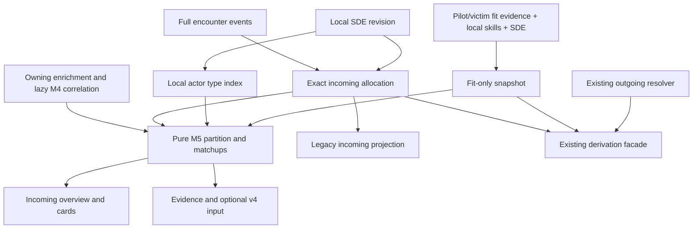

# Milestone 5: Per-Attacker Incoming Damage Profile and Defense Matchup — Technical Design

**Status.** Technical contract for planning and implementation; no M5 implementation is claimed.
**Author.** Technical Architect.
**Date.** 2026-09-14.
**Baseline.** `feature/aar-per-attacker-matchup` at `ed9e1ff`, after M4 `d2dd731`.
**Product authority.** [Milestone 5 specification](aar-per-attacker-matchup.md).
**Prior contracts.** [Architect handoff](../../.codex/checkpoints/2026-09-14-architect-handoff.md),
[M4 correlation design](aar-zkill-attacker-correlation-design.md), and
[fit derivation design](aar-fit-simulation-and-defense-profiles-design.md).

This document specifies the HOW. Product R1–R19, D1–D10, S1–S5, numerical fixtures
A–D, and all 28 release criteria remain authoritative. Product names those criteria
F01–F10, Q01–Q10 and V01–V08; §5 supplies the requested AC1–AC28 aliases without
renumbering Product. Code signatures below are **proposed changes**, except where
explicitly identified as existing. New files are listed as code paths until created.

## 1. Executive summary and architecture invariants

### 1.1 Decision

Build one exact incoming allocation from the complete local event set, independently
of identity and fitting. Apply the existing correlation as a validated partition of
those source allocations. Compare each Confirmed/Probable positive source, and the
aggregate reference, against the same pilot-defense snapshot. Keep the result in
provider memory and supply that same result contract to UI, evidence and prompt.

Use plain immutable Dart classes, matching the combat analyzer. Freezed is present
in the project but is unnecessary here: no generated-model migration is required.
Use reduced `BigInt` rational quantities for canonical typed components, integer
logged/resolved/untyped totals, and `double` only at the numerical formula/display
boundary. There is no new dependency or database migration.

### 1.2 All ten inherited contracts

| Handoff contract | M5 treatment |
| --- | --- |
| 1. Classification precedes identity; domain has no I/O | Consume M4 classes; use exact local category-11 lookup only for residual NPC classification when correlation is absent/rejected. Allocation and matching mathematics remain pure. |
| 2. Participant pool includes victim, excludes user; timing only on own loss | Validate and consume that pool. A victim's return fire is eligible; do not consult victim `damageTaken` or outgoing events for incoming amounts. |
| 3. Six weights, thresholds and confidence caps | Unchanged. Read the final `CorrelatedAttacker.confidence`, including shipType's Probable cap. M5 never calls `bandFor(score)` to promote it. |
| 4. Correlated + unattributed + NPC equals incoming | Preserve the stored M4 partition. M5 moves Possible amounts into its own X bucket; exact scalar and component invariants are defined in §1.3. |
| 5. Correlate after names; JSON round-trip; lazy cache backfill | Reuse `combatAttackerCorrelationProvider` and the existing ensure seam. No display-time rescore of a non-null correlation or provider write loop. |
| 6. Additive v4, no new quantitative network I/O/migration; non-fatal failures | Preserve `killmailEvidence.attackerCorrelation`; add only `damageMatchups.perAttackerIncoming`. Explicit local-only fit lookup policy closes the existing effect-fetch escape path. |
| 7. Evidence detail does not change scores/actions or reveal attacker fits | Keep scorer statuses, weights, Missing iff actionable, and attacker-fit unknowns. Separate identity certainty from modeled profile/defense facts. |
| 8. One incoming ranking; null has plain source rows; deferred matchups | **M5 explicitly activates the previously deferred matchup consumer.** Replace the M4 ranking with richer source cards, retaining evidence/fallback/footer. Product R17 supersedes M4's two-correlated-participant advisory trigger with two positive raw sources. |
| 9. Shared fitting inputs, weighted EHP, explicit skill basis, nonblocking checklist | Reuse the loader and fit-selection policy; derive pilot defense once and retain known-character/All V, tank and module assumptions. |
| 10. Tagged logs, `.when()` states and no displayed raw EVE IDs | Use `[AAR.MATCHUP]`; scope errors; render structured names/fallbacks, never unfiltered legacy `Type #…` or skill-context IDs. |

H8's deferral and advisory are the only inherited behavior intentionally replaced;
the user and Product explicitly authorize that extension. M4 identity facts are not
rewritten to express the stricter M5 display gate.

### 1.3 Exact accounting and independent confidence axes

For a positive raw source b: integer `D_b` is logged damage, `K_b` the sum of fully
resolved weapon amounts, and `U_b` the unresolved amount. Its four rational components
`C_b` sum **exactly** to integer K. Each weapon resolves wholly or contributes wholly
to U; no estimate of missing ammunition fills a component.

```text
D_b = K_b + U_b = C_b.EM + C_b.Thermal + C_b.Kinetic + C_b.Explosive + U_b
A = Confirmed/Probable positive attributed sources
X = Possible + all other unassigned/rejected sources, excluding NPC
N = NPC sources
T = sum(D_a for a in A) + D_X + D_N
C_aggregate[t] = sum(C_a[t] for a in A) + C_X[t] + C_N[t], for each type t
U_aggregate = sum(U_a for a in A) + U_X + U_N
T = sum(C_aggregate[t]) + U_aggregate
```

These are reduced-rational/integer equality assertions, never epsilon comparisons.
X and N are sums of already allocated sources. Untyped is a subtotal across A/X/N,
not a fourth owner. For valid M4 inputs: `D_X = M4.unattributedIncomingDamage +
PossibleDamage` and `sum(D_a) = M4.correlatedIncomingDamage - PossibleDamage`.
M4 `unattributedActors` includes NPCs; filtering before summation is mandatory.

| Axis | Meaning | What it cannot establish |
| --- | --- | --- |
| Identity confidence | M4 Confirmed/Probable/Possible assignment and original signals | Whether an observed weapon resolves, or the attacker's modules |
| Weapon resolution coverage | `K_b / D_b`; components estimated from exact logged weapon SDE attributes | Identity certainty or measured damage-by-type/pre-resistance volleys |
| Defense provenance | Pilot fit source, skill basis, selected tank layer, module assumptions and limitations | The opponent's fit or a guarantee that this model reproduces the fight |

An eligible zero-coverage source still has a card, but no pattern/EHP/hole. Positive
coverage has no minimum-share threshold. A partial profile qualifies every numerical
claim as **Resolved portion only**. Missing/failed defense cannot erase the profile.

### 1.4 Findings that determine implementation scope

| Existing code fact | Required seam |
| --- | --- |
| `CombatDamageProfile` entries have integer amounts; resolver rounds entries separately; `toDamagePattern()` normalizes those ints while pressure reads `percent` | Exact incoming model plus one explicitly lossy compatibility projection; incoming formulas use a canonical pattern, never that projection. Outgoing behavior remains unchanged. |
| `CombatLogActor.key` normalizes names; classifier metadata can combine normalized variants | Allocate by parser raw source first; join with exact raw precedence and uniqueness checks. Do not derive weapons from `actor.weaponNames`. |
| `AttackerCorrelation` has a killmail ID but no encounter/event fingerprint | Validate its owning `CombatEnrichment.parsedEncounterId`, selected killmail and all available source metadata. State the legacy lineage limit in §2.4. |
| Fit derivation currently awaits both damage profiles before selecting/deriving fits | Extract fit-only derivation, then compose matchups. A profile/identity change must not rerun Dogma. |
| `loadFittingStatsInputs()` calls `ensureEffectModifiers()`, which may call ESI | Add an explicit local-only lookup policy for AAR snapshots; missing effects become recorded limitations. |
| `CombatDamageMatchup.toJson()` omits pattern, layered EHP and omni EHP | Serialize M5's richer defense result explicitly; do not rely on the old serializer. |
| Current primary-hole loop can select a zero-share type; zero pressure uses equal shares | New incoming-specific entry point enforces R13–R15; legacy outgoing entry point keeps its behavior. |
| Current Damage tab requires a report and awaits outgoing resolution | Extract report-optional local Damage content with independently scoped incoming/outgoing states. |
| `sdeInitializerProvider` signals initial completion, not subsequent data changes | Add observable local SDE revision/readiness and watch local character-skill rows. No constant-version-only invalidation. |

## 2. Detailed technical contracts and pure domain models

### 2.1 Files, immutability and quantity representation

New domain files under `lib/features/combat_analyzer/domain/`:

- `incoming_damage_allocation.dart`: exact quantities, vectors, weapon/source allocation and input state.
- `incoming_damage_allocator.dart`: positive-event validation and allocation.
- `aar_attacker_matchup.dart`: attribution, defense, bundle and snapshot value types.
- `incoming_damage_matchup.dart`: small incoming defense DTOs, independent of fit/bundle models.
- `damage_matchup_assessment.dart`: shared assessment enum/helper, re-exported from its old path.
- `aar_attacker_matchup_deriver.dart`: correlation validation, partition, numerical composition.
- `aar_attacker_matchup_facts.dart`: fresh evidence projection and prompt serialization.

Collections are defensive unmodifiable copies; equality/hash use values, not mutable
collection identity. Pure constructors/builders take time/provenance as inputs;
no `DateTime.now()`, database, providers or I/O. Logging through the existing logger
is allowed. Keep helpers small; do not introduce a general symbolic-math library.

```dart
enum IncomingDamageType { em, thermal, kinetic, explosive } // canonical tie order

final class DamageQuantity implements Comparable<DamageQuantity> {
  factory DamageQuantity(BigInt numerator, BigInt denominator);
  factory DamageQuantity.fromInt(int value);
  factory DamageQuantity.fromSdeNumber(num value);
  final BigInt numerator;   // >= 0; fraction always reduced
  final BigInt denominator; // > 0; zero is 0/1
  DamageQuantity operator +(DamageQuantity other);
  DamageQuantity operator *(DamageQuantity other);
  DamageQuantity operator /(DamageQuantity positiveOther);
  int compareTo(DamageQuantity other); // cross multiply, no double conversion
  double toFiniteDouble();
  Map<String, String> toJson(); // {"n":"1", "d":"4"}
  factory DamageQuantity.fromJson(Map<String, dynamic> json);
}

final class IncomingDamageVector {
  IncomingDamageVector({required DamageQuantity em, required DamageQuantity thermal,
    required DamageQuantity kinetic, required DamageQuantity explosive});
  DamageQuantity operator [](IncomingDamageType type);
  DamageQuantity get total;
  IncomingDamageVector operator +(IncomingDamageVector other);
  DamagePattern? toPattern(); // null iff total == 0; label: SDE-derived incoming
  Map<IncomingDamageType, int> projectLegacyInts();
  Map<String, dynamic> toJson(); // em/thermal/kinetic/explosive -> quantity
}
```

`fromSdeNumber` rejects negative and nonfinite values. Parse integer digits directly;
for a `double`, parse its locale-independent shortest round-trip `toString()` as an
exact decimal including exponent. Thus `0.1 : 0.2` becomes `1 : 2`, not an
independently rounded floating-point ratio. Reduce with gcd after operations.
This is exact **relative to that canonical rendering of the loaded SDE values**;
it does not recover precision already discarded before SQLite/Dart loaded them.
Record `quantityBasis: sde-decimal-v1` in the bundle. Binary64 expansion is unnecessary
and obscures simple intended decimal ratios.

For very large numerator/denominator values, `toFiniteDouble()` must use scaled
integer division, not `numerator.toDouble()/denominator.toDouble()` which can yield
Infinity/Infinity. Ratios in [0,1] use bounded significant digits and finite checks.
A positive canonical type whose ratio underflows numerical representation keeps its
exact allocation but makes the numerical comparison unavailable with
`numericPrecisionUnavailable`; do not silently convert it to absent damage.

Legacy integer projection: floor each component, then distribute
`K - sum(floors)` units to largest exact fractional remainders, ties in enum order.
K is integral for complete source/aggregate vectors. Zero components never receive
units ahead of a positive remainder. This projection exists only for old int-shaped
fields. It is not required to be component-additive across independently projected
sources; **canonical rational vectors are the conservation contract**. New UI/prompt
never present this projection as exact component evidence.

Display four-type percentages separately: apportion 1,000 tenths of one percent from
the exact ratios by the same largest-remainder rule; sum is 100.0%. Damage share and
coverage use their own denominators and ordinary display rounding. Never feed display
percentages back into formulas.

### 2.2 Allocation models and resolver input

```dart
enum WeaponResolutionStatus {
  resolved, missingName, noExactType, ambiguousType,
  noPositiveDamage, invalidAttributes, lookupFailed
}

final class IncomingWeaponResolution {
  final String normalizedName;
  final int? typeId; final String? typeName;
  final WeaponResolutionStatus status;
  final IncomingDamageVector? attributes; // raw exact SDE ratios; only resolved
  final String? reasonCode;
}

final class IncomingWeaponContribution {
  final String weaponKey; // normalized logged weapon, or reserved missing key
  final List<String> rawWeaponNames;
  final List<String> eventIds; // local provenance; do not send raw transcript
  final DateTime firstSeen, lastSeen;
  final int loggedDamage, resolvedDamage, untypedDamage;
  final IncomingDamageVector components;
  final IncomingWeaponResolution resolution;
}

final class IncomingSourceAllocation {
  final String sourceId; // stable, encounter + exact parser raw source key
  final String rawActorName; final String normalizedActorName;
  final List<String?> observedActorNames; // retains null/empty provenance
  final int loggedDamage, resolvedDamage, untypedDamage;
  final IncomingDamageVector components;
  final List<IncomingWeaponContribution> weapons;
  final DateTime firstSeen, lastSeen;
}

final class IncomingDamageAllocation {
  final String encounterId, allocationKey, sdeContentKey;
  final String pilotName;
  final int? pilotCharacterId;
  final DateTime encounterEnd;
  final int totalIncomingDamage, resolvedDamage, untypedDamage;
  final IncomingDamageVector components;
  final List<IncomingSourceAllocation> sources;
  bool get accountsForAllDamage; // validates every scalar/vector invariant
  CombatDamageProfile toLegacyProfile();
}

sealed class IncomingAllocationResult {}
final class IncomingAllocationReady extends IncomingAllocationResult {
  final IncomingDamageAllocation allocation; // includes valid T=0 empty result
}
final class IncomingAllocationInvalid extends IncomingAllocationResult {
  final String encounterId, reasonCode;
  final List<String> affectedSourceIds;
}

final class IncomingDamageAllocator {
  static IncomingAllocationResult allocate({
    required ParsedCombatEncounter encounter,
    required Map<String, IncomingWeaponResolution> weapons,
    required String sdeContentKey,
  });
}
```

All fields in these contract sketches are constructor inputs or derived getters;
constructors validate the relationships above. Allocation, composition and projection
must validate at runtime, not only under Dart assertions. Typed failure is distinct
from a legitimate empty result; provider loading/transport failure is a third axis.

### 2.3 Event allocation algorithm

1. Prevalidate incoming `kind == damage` events for negative amounts **before** the
   `isIncomingDamage` predicate (that predicate already filters nonpositive values).
   Negative incoming damage invalidates the numerical bundle. Parsed amounts are ints;
   malformed/nonfinite external numeric data must be rejected at its adapter boundary.
2. Select positive `isIncomingDamage` events only, from the complete encounter.
   Exclude zero, misses, outgoing, repairs, capacitor and e-war. Do not truncate at
   `CombatLogParser.maxLlmEvents` and do not substitute killmail damage.
3. Reproduce the parser's raw aggregate source key (`targetName ?? 'Unknown'` at this
   baseline), retaining original null/empty names separately. Do not trim/case-fold
   the ownership key. Validate the rebuilt raw totals against
   `aggregates.incomingBySource` and `totalDamageReceived`; extra positive raw buckets
   or mismatched sums produce `IncomingAllocationInvalid('eventTotalsMismatch')`.
   Zero-valued aggregate entries may be ignored; negative aggregate entries are invalid.
4. Build a stable source ID from encounter ID and a length-safe encoding of the exact
   raw source key (base64url UTF-8 or hash of canonical JSON; not a normalized key).
   Normalize weapon names with `normalizeCombatName` solely for lookup memoization.
   Missing/empty/Unknown weapons get a reserved key that cannot collide with an actual
   normalized name. One source's repeated weapon events may be summed before allocation
   because they use the same exact vector; preserve event IDs, raw names and time span.
5. For weapon total d and validated positive attribute vector a:
   `C[t] = rational(d) * a[t] / sum(a)`, `K=d`, `U=0`. Unresolved/failed/invalid vector:
   `C=0`, `K=0`, `U=d`, with resolution reason. Missing attributes are zero; negative or
   nonfinite provided attributes invalidate that entire weapon, not the known siblings.
6. Sum exact weapon components into source components, then all source components into
   aggregate. Assert all §1.3 equations. The typed components never depend on M4 grouping.
7. Source order for allocation serialization is stable source ID; weapons sort by
   normalized weapon key and raw spellings; event provenance sorts by timestamp and
   stable event ID. UI ranking is a separate projection (§4). Reordering maps/events
   with the same IDs and semantic values changes neither allocations nor evidence IDs.

Use UTF-8 canonical JSON and the existing `crypto` SHA-256 dependency for snapshot
content keys: sorted explicit fields, enum names, UTC times, exact quantity strings;
no Dart `hashCode`, wall clock, display rounding or raw transcript. Include encounter
ID/pilot/time bounds, included events and aggregate validation inputs. The key is for
coherent local results, not a claim that an old M4 row stored its original lineage.

Accumulate event/source/weapon/resolved/untyped totals in `BigInt`, then check before
converting to the public integer fields. The supported public range is 0 through
`9007199254740991` (exact JSON/double-safe integers on all clients); inputs/totals outside
it yield `IncomingAllocationInvalid('integerOverflow')`. Never add native ints first
and inspect a possibly wrapped result. Component fractions remain arbitrary precision.

### 2.4 Identity validation and strict partition

```dart
enum IncomingSourceBucket { attributed, unattributed, npc }
enum CorrelationBindingStatus {
  valid, legacyStructuralValidation, unavailable, rejected
}

final class IncomingCorrelationContext {
  final String parsedEncounterId;
  final int? selectedKillmailId, selfCharacterId;
  final bool? selfIsVictim;
  final AttackerCorrelation? correlation;
  final List<CombatKillmailParticipant> currentParticipants;
  final Map<String, CombatTypeRef> localActorTypes; // exact unique name resolution
}

final class AarIncomingSource {
  final IncomingSourceAllocation allocation;
  final IncomingSourceBucket bucket;
  final CorrelatedAttacker? identity; // candidate retained for Possible in X
  final CorrelationBindingStatus binding;
  final List<String> limitationCodes;
  bool get namedCardEligible; // attributed + C/P + positive observed damage
}
```

The data layer supplies the **owning enrichment** and cached selected raw killmail;
do not accept an unrelated correlation argument without its envelope. Check:

- `enrichment.parsedEncounterId == encounter.id`, current selected killmail ID equals
  correlation and raw-detail ID, and own-loss perspective matches current pilot/victim.
- Participants occur in that cached detail by stable character ID and victim role;
  exclude self, disallow NPC/player confusion, require unique assigned participants.
  M4 keys `a0`, `a1` are provenance only, not durable participant identity.
- Stored M4 scalar totals reconcile; each correlated/unattributed actor can bind once
  to event-derived sources. All rows' raw totals, available normalized weapon sets and
  first/last timestamps must agree. Metadata is a validation input, never a weight.
- Exact raw `actor.displayName` match wins only if unique. Reserve those bindings first.
  A remaining normalized match is allowed only with one unmatched source and one
  unmatched M4 row for that key. Never aggregate multiple aliases into one actor, choose
  the highest score among conflicting rows, or fan one event into several cards.
- Duplicate raw row/participant assignments invalidate all involved bindings. A local
  conflict moves affected sources to X; a global envelope/scalar/perspective mismatch
  rejects the entire identity snapshot. Source typing and aggregate remain available.

Unknown correlation `rulesVersion`, a missing selected raw detail, or missing pilot
identity that prevents proving self exclusion/perspective yields attribution unavailable,
not guessed ownership. Do not discard allocation or local NPC classification. Current
supported M4 rules version is 1; future versions require explicit compatibility tests.

M4 has no persisted event fingerprint. Existing rows use
`legacyStructuralValidation`: validate every observable field, retain a limitation
that original event lineage was not stamped, and never label the check as proof of
that lineage. Observationally identical copied rows cannot be distinguished from the
original without producer metadata. This limitation does not authorize a silent
identity recomputation. Adding a durable producer fingerprint is a separate hardening
change, not a prerequisite for reading current M4 caches.

Partition after validation:

1. Valid M4 NPC class goes to N. Without usable correlation, run the existing
   `CombatActorClassifier` with the current participant pool and unique exact local
   type index; only its resulting `npc` class establishes N. Its player-name/type-name
   collision precedence must remain intact: such a collision is ambiguous, not an NPC
   based on category alone. Use only its class, never its normalized weapons/timing for
   allocation. A genuinely contradictory class rejects the binding with a limitation;
   a legitimate ambiguous player/type collision is not a contradiction. No drone-owner inference.
2. Valid C/P assignment with `participant.isPlayer` and positive source amount goes to A.
   A shipType row with an impossible stored Confirmed band is rejected as inconsistent;
   M5 does not silently repair/re-score its band.
3. Valid Possible goes to X, preserving candidate identity/signals as uncertain evidence.
4. Everything else goes to X. Unknown sources with a known weapon can still be typed.
5. Unobserved killmail participants produce footer entries, not zero-damage profiles.
   Do not label a participant whose binding was rejected as definitively unobserved:
   show it in the attribution issue details instead.

M5 does not modify `AttackerCorrelation` or its scalar totals. Null legacy correlation
uses the existing lazy ensure. A rejected non-null correlation offers a **local** retry
to reload the owning cached envelope; any intentional rerun of M4 correlation is an
explicit refresh through the existing correlator with cached data, never a new search
or an implicit attempt to make the numbers fit. M5's default retry only reloads inputs.

### 2.5 Defense result, gating and formulas

```dart
enum IncomingDefenseStatus {
  available, noTypedDamage, pilotDefenseUnavailable,
  invalidDefense, numericPrecisionUnavailable
}
enum IncomingPressureStatus { available, unknownLayer, zeroDenominator, unavailable }

final class IncomingResistResult {
  final IncomingDamageType type;
  final double profileFraction;
  final double? resistPercent, modeledPressure;
  final DamageMatchupAssessment assessment;
}

final class AarIncomingDefenseMatchup {
  final IncomingDefenseStatus status;
  final IncomingPressureStatus pressureStatus;
  final DamagePattern? pattern;
  final LayeredEhp? ehp, omniEhp;
  final TankLayer layer;
  final List<IncomingResistResult> entries; // canonical four-type order
  final IncomingDamageType? primaryHole;
  final List<TankLayer> guardedLayers; // q<=0 finite fallback, including omni guards
  final List<String> limitationCodes;
  final String? pilotFitKey;
}

final class AarAttackerMatchup {
  final AarIncomingSource source;
  final AarIncomingDefenseMatchup defense;
}

final class AarIncomingMatchupBundle {
  final String encounterId, snapshotKey;
  final IncomingDamageAllocation allocation;
  final List<AarAttackerMatchup> attackers; // A only; zero-coverage cards included
  final List<AarIncomingSource> unattributed, npc;
  final List<CombatKillmailParticipant> notObserved;
  final AarIncomingDefenseMatchup aggregateDefense;
  final AarFitDerivation? pilotFit;
  final FitEvidence? pilotFitEvidence; // actual selected source; confidence/time
  final List<String> limitationCodes;
  final CombatEvidenceLedger evidence;
  Map<String, dynamic> toPromptJson();
}

final class AarAttackerMatchupDeriver {
  static AarIncomingMatchupBundle derive({
    required IncomingDamageAllocation allocation,
    required IncomingCorrelationContext correlation,
    required AarFitDerivation? pilotFit,
    required FitEvidence? pilotFitEvidence,
    required String? pilotFitKey,
    required List<String> dependencyLimitations,
  });
}
```

`AarIncomingMatchupBundle` requires valid allocation; invalid input never becomes a
zero bundle. X/N do not carry individual numerical matchups. Their typed components
still contribute to aggregate defense. `aggregateDefense` uses the same gate/formulas
as A, but has a combined-source label and no attributed identity.

Add to existing `CombatDamageMatchupAnalyzer` an incoming-specific pure entry point:

```dart
static AarIncomingDefenseMatchup analyzeIncoming({
  required IncomingDamageVector components,
  required DefenseProfile? defense,
  required TankAssessment? tank,
  required String? pilotFitKey,
});
```

Reuse the existing relative-resist assessment helper and `DefenseProfile.ehpAgainst`.
Keep the existing `analyze(profile:…, defense:…, tank:…, targetLabel:…)` signature
and outgoing behavior. Do not route M5 through `CombatDamageProfile.toDamagePattern()`.
Place only the small incoming defense DTOs (`IncomingDefenseStatus`,
`IncomingPressureStatus`, `IncomingResistResult`, `AarIncomingDefenseMatchup`) in
`incoming_damage_matchup.dart`. Move `DamageMatchupAssessment` and the shared resist
helper into neutral `damage_matchup_assessment.dart`, re-exporting the enum from the old
path. The analyzer imports the small DTOs/enum, never the full M5 bundle file (which
also depends on `AarFitDerivation` and therefore the legacy matchup model).

Evaluation order:

1. K=0 → `noTypedDamage`, null pattern/EHP/hole. No omni substitute.
2. Convert exact fractions `p=C/K` once to the canonical `DamagePattern`; both EHP
   and pressure use those same double values. No second normalization of int entries.
3. Missing defense → `pilotDefenseUnavailable`; keep pattern. Validate every layer's
   HP finite and >=0 and all resists finite in [0,100], even zero-HP layers; all-zero
   HP is invalid/unavailable. Invalid values produce no EHP/pressure claim.
4. For each layer compute `q=sum(p[t]*(1-r[t]/100))`. Call the shared EHP extension
   using the same pattern, and once with omni for the fit snapshot. Preserve `q<=0`
   fallback to raw HP and record a guard limitation. Zero HP contributes zero. If a
   finite positive q would overflow EHP, mark numerical comparison unavailable.
5. Use `pilotFit.tank.layer` unchanged; never classify by this source's damage mix.
   Unknown/null layer keeps valid layered EHP but marks pressure/hole unavailable.
6. On selected layer: hole if resist<=20 **or** resist<=mean-5; else strong if
   resist>=mean+5; else neutral. When `sum(w)<=0`, return no pressure/hole with
   `zeroDenominator`, even though guarded EHP may exist. Never equal-share fallback.
7. With positive denominator, `w=p*(1-r/100)`, `pressure=w/sum(w)`. Primary hole is
   maximum pressure among **positive canonical types** classified hole. Exact double
   ties use enum order, with no epsilon tie rule. No candidates means null hole and
   available pressure: “No resist hole pressured by this profile.”

Total EHP is the sum of layer EHP; attacker share never scales it. No summation or
average of attacker EHP replaces aggregate EHP. Call `analyzeIncoming` on aggregate
components separately. Cache the fit's validated omni result once per fit snapshot.
Numerical tests use Product tolerances (EHP 1e-6, fractions/pressure 1e-9); amount
tests use exact equality.

## 3. Data layer, resolvers, providers, evidence and prompt

### 3.1 Resolver: one local incoming allocation

Extend `CombatDamageProfileResolver` in
`lib/features/combat_analyzer/data/combat_damage_profile_resolver.dart`:

```dart
Future<IncomingAllocationResult> resolveIncomingAllocation(
  ParsedCombatEncounter encounter, {required String sdeContentKey});

// Existing signatures retained:
Future<CombatDamageProfile> resolveIncomingProfile(ParsedCombatEncounter encounter);
Future<CombatDamageProfile> resolveOutgoingProfile(ParsedCombatEncounter encounter);
```

`resolveIncomingAllocation` obtains distinct normalized positive-event weapon names,
resolves each once, and calls the pure allocator. Initialize local bundled SDE first.
Match exactly after `normalizeCombatName`; never accept fuzzy substring search as
resolution. Existing `searchTypesByName(...limit:20)` is not a guarantee that the exact
match was returned. Add an exact-name database helper/query if needed; ambiguous
normalized exact matches are unresolved, not “take the first row.”

Read type damage attributes 114/118/117/116 (EM/Thermal/Kinetic/Explosive) via the
existing SDE damage lookup. Memoize by normalized name within the snapshot; share that
table across all sources. A resolved type with absent/nonpositive vector is untyped
even if its group is a plausible launcher. No charge inference or killmail weapon ID
fallback. Catch per-weapon lookup failures with stack traces and retain untyped damage;
SDE initialization/global failure remains an unavailable/error state.

`resolveIncomingProfile` delegates to that allocation and returns `toLegacyProfile()`;
the provider path watches the shared allocation directly to avoid a second resolution.
Compatibility projection keeps `totalProfiledDamage=K`, existing field names,
confidence/source labels and known/unknown weapon sets. Entry `percent` uses exact
C/K at the formula boundary, while entry `amount` is the legacy integer projection.
Outgoing resolver and its regression expectations are unchanged.

Expose all four entries for positive K, including zero components. M3 score coverage
continues using K/T; no change to evidence-scoring rules. A change in incoming rounded
entry amounts is permitted by R10, but not a change caused by adding correlation.

### 3.2 Fit-only derivation and quantitative local-only policy

Add a fit-only method to `CombatFitDerivationService`:

```dart
Future<AarDerivationBundle> deriveFitsForEncounter({
  required ParsedCombatEncounter encounter,
  required CombatEnrichment enrichment,
  required AarSkillContext? selfSkills,
  required AarSkillContext? opponentSkills,
  List<String> selfInputIssues = const [],
  List<String> opponentInputIssues = const [],
}); // self/opponent/unknowns populated; matchup fields null

AarDerivationBundle composeMatchups({
  required AarDerivationBundle fits,
  required IncomingDamageAllocation? incoming,
  required CombatDamageProfile? outgoing,
  required ParsedCombatEncounter encounter,
  required CombatEnrichment enrichment,
});
```

The existing `deriveForEncounter` remains a compatibility wrapper: add optional named
`IncomingDamageAllocation? incomingAllocation`; when supplied, compose canonical incoming
results. Old callers supplying only legacy `incoming` retain their old analyzer path.
Production UI/analysis calls share fit-only snapshots and supply canonical allocation.
Its existing selection semantics must be preserved exactly: explicit pilot evidence
is tried first; if successful, it wins over own-loss victim evidence. **Current code
falls back to own-loss victim evidence if the explicit pilot derivation fails.** Do
not replace that with unconditional evidence-presence precedence. On a won fight,
victim evidence derives opponent defense only. Resolve each chosen fit once, reusing
the same derived self object for all incoming comparisons. Dogma's fit+bare-hull pair
is one logical fit derivation, not one engine invocation.

`composeMatchups` uses new incoming analysis for aggregate self; project the result to
the existing `CombatDamageMatchup` shape for `AarDerivationBundle.selfMatchup` using
canonical pattern, explicit EHP and guarded pressure. Int `amount` is serialization
compatibility only. Outgoing still calls the existing analyzer. Missing incoming may
omit selfMatchup without suppressing fit/outgoing; missing outgoing omits only its
matchup. Existing callers lacking canonical incoming remain supported, but M5 UI and
explicit analysis must pass the canonical allocation. Catch skill, input-loading and
engine failures per subject, including failures before the old `deriveEvidence` try
block; a failed opponent derivation must not erase valid self defense (and vice versa).
Select `pilotFitEvidence` for M5 from the actual successful self derivation's role and
source, including the own-loss fallback, rather than the first attempted fit.

Quantitative lookups:

- Skills: `SkillRepository.watchCharacterSkills/getCharacterSkills` read local Drift.
  Empty successful rows → existing All V fallback; query failure → unavailable fit,
  not a fabricated empty skill set. Opponent stays All V under existing policy.
- Add `EffectLookupPolicy { localOnly, allowNetwork }` to SDE/fitting input seams.
  `loadFittingStatsInputs(..., effectLookupPolicy: localOnly)` is required for AAR;
  existing fitting callers keep their default behavior.
- Local-only effect resolution checks bundled then cached data, never Dio and
  never `_modifierFetchAttempted` network-negative-cache mutations. Its result must
  distinguish known-empty modifier lists from absent effects. Extend `FittingStatsInputs`
  with `unavailableEffectIds` (default empty); missing effects produce inspectable fit
  limitations rather than claims of complete modifier coverage. Shared input loading
  and engine math remain the same.
- `SdeService.initialize/getShipType/getDogmaTypes` are local at this baseline. Normal
  name-resolution providers may use their existing presentation network paths; those
  cannot block quantitative allocation or defense.

Exact additive SDE seam:

```dart
final class EffectModifierInputs {
  final Map<int, List<EffectModifier>> modifiers;
  final Set<int> unavailableEffectIds;
}
// SdeService; old ensureEffectModifiers(ids) remains a Map-returning wrapper.
Future<EffectModifierInputs> loadEffectModifierInputs(
  Iterable<int> effectIds, {required EffectLookupPolicy policy});
```

The old wrapper delegates with `allowNetwork`; the shared fitting loader uses the
new result to retain unavailable IDs. `FittingStatsInputs.unavailableEffectIds` is an
unmodifiable set with an empty default. New AAR callers explicitly pass
`effectLookupPolicy: EffectLookupPolicy.localOnly`; no caller infers policy from UI.

### 3.3 Provider graph and state composition

The following names and types are the implementation contract (auto-dispose families
are appropriate for encounter-local results):

| Provider | Type / dependencies | Responsibility |
| --- | --- | --- |
| `aarSdeRevisionProvider` | `StreamProvider<AarSdeRevision>` after `sdeInitializerProvider` | Ready revision of local types/groups/attributes/effects/modifier cache/metadata; recomputes on relevant DB commits. |
| `aarLocalSkillsProvider(characterId)` | `StreamProvider.family<List<CharacterSkill>, int>` | Local trained-skill rows; content equality prevents irrelevant rebuilds. |
| `combatIncomingDamageAllocationProvider(encounter)` | `FutureProvider.family<IncomingAllocationResult, ParsedCombatEncounter>` | Full events plus SDE revision; no correlation or fit dependency. |
| `combatIncomingDamageProfileProvider(encounter)` | Existing `FutureProvider` | Legacy projection of that same allocation. |
| `aarLocalActorTypesProvider(encounter)` | `FutureProvider.family<Map<String,CombatTypeRef>, ParsedCombatEncounter>` | Exact local category lookup for raw source names; shared per snapshot, no identity inference. |
| `combatAttackerCorrelationProvider(encounter)` | Existing `FutureProvider` | Sole display owner of existing lazy correlation ensure. |
| `aarFitSnapshotProvider(fitRequest)` | `FutureProvider.family<AarDerivationBundle, AarFitRequest>` | Fit-only derivation keyed by selected fit inputs, skills, assumptions and SDE revision. |
| `aarIncomingMatchupsProvider(encounter)` | `Provider.family<AarIncomingMatchupState, ParsedCombatEncounter>` | Synchronously joins current allocation, correlation, local classification and self-fit AsyncValues without awaiting them as one all-or-nothing future. |
| `aarFitDerivationsProvider(encounter)` | Existing `FutureProvider` facade | Shared fit snapshot + canonical incoming aggregate + independent outgoing; preserves M3 consumers. |



`AarFitRequest` is an immutable value key, with canonical fitting JSON/module states,
source role/fit confidence, self/victim perspective, character ID, actual skill rows
and SDE revision. It excludes correlation, incoming/outgoing profiles, report text,
card expansion, and wall-clock `derivedAt`. Preserve current module assumption
limitations. The common fit snapshot is reused by both the legacy facade and M5.

```dart
final class AarSdeRevision {
  final int generation; // process-local invalidation token only
  final String contentKey; // deterministic local row/asset revision digest
}
final class AarFitRequest {
  final String encounterId, pilotName, requestKey;
  final int? pilotCharacterId, victimCharacterId;
  final FitEvidence? pilotEvidence, victimEvidence;
  final AarSkillContext? selfSkills, opponentSkills;
  final List<String> selfInputIssues, opponentInputIssues;
  final AarSdeRevision sde;
}
enum AarIncomingDependencyStatus { loading, ready, unavailable, error, invalid }
final class AarIncomingMatchupState {
  final String encounterId, allocationRequestKey, identityRequestKey;
  final String? fitRequestKey;
  final AarIncomingMatchupBundle? bundle;
  final AarIncomingDependencyStatus allocationStatus, correlationStatus,
    classificationStatus, defenseStatus;
  final List<String> issueCodes;
}
```

Null skill context plus subject-specific input issues means that subject failed;
the other subject can still derive. No-fit evidence is separately represented by
null evidence. `AarFitRequest` equality includes content fields/requestKey, not the
mutable source object or unrelated enrichment ledger. The fit-only result preserves
successful subjects and records failed ones as unknowns.

Define `AarIncomingMatchupState` with `encounterId`, current request keys, optional
valid `bundle`, independent `allocation/correlation/defense` dependency statuses
(`loading/ready/unavailable/error/invalid`) and structured error/limitation codes.
It is not an `AsyncData(empty)` wrapper for failed work. The synchronous provider
uses `.when()` on each dependency, not throwing `.value` reads:

- Allocation loading/failure/invalid → no quantitative bundle; render scoped state.
- Allocation ready, correlation pending/error → source allocations remain visible;
  classify only independently established NPCs, put others in X with an explanation.
- Allocation and identity ready, fit pending/error → cards keep profiles with defense
  loading/unavailable. Numerical EHP appears only for the matching fit request key.
- Do not temporarily put a previous correlation's identity over a new event snapshot,
  or previous fit EHP under new provenance. Previous results may remain visible only
  when their relevant keys are unchanged. Use encounter-keyed subtree replacement on
  encounter switches; do not blindly set `skipLoadingOnReload:true` for identity changes.

Subscribe to upstream providers before starting awaits, discard obsolete async
completions after invalidation/disposal, and compose only matching request keys.
`ParsedCombatEncounter` object identity alone is not the snapshot contract: semantic
event fingerprints and fit value keys protect same-ID edits as well as new encounters.

### 3.4 Revision, retries and cache custody

Add a narrow local `SdeDatabase.watchDerivationRevision()` stream adapter. It emits
after readiness and relevant Drift commits to types, groups/categories, attributes,
type effects, effect modifiers and version metadata, including same-version changes.
A monotonic in-process generation drives invalidation; a content digest of loaded
relevant rows and bundled-effect version goes in `sdeContentKey` for deterministic
evidence. Do not put the process generation in stable fact IDs. A revision notification
alone is insufficient for coherent reads: collect allocation/fit SDE inputs in a local
read transaction, or read the revision before and after the multi-query load and discard
and retry if it changed. Publish only results for the revision actually read.

The baseline opens independent SDE SQLite connections per window; it has **no SDE
cross-window invalidation event**. Implement the adapter using local Drift table
notifications plus a local `PRAGMA data_version` check on the same long-lived connection
every second while a visible M5 consumer is active, and immediately on resume. External
commits detected by a changed value invalidate readiness/request keys and rebuild from
a coherent read; the active external-update detection bound is one second. Do not hash
or compare `data_version` numbers across different connections. Stop the timer when
there are no active consumers; hidden/resumed views recheck before showing cached
quantities. If the SDE service replaces its connection, dispose the old subscription
and invalidate readiness. The paired-window P05 fixture must mutate SDE through a
second connection and verify the first recomputes; a local table stream alone is not
sufficient. This is local SQLite observation, not a network poll.

Clear/version `_allFiveSkills` and any lookup memo when the SDE revision changes.
Local fit/skill observations invalidate defense without rerunning weapon lookups;
correlation changes invalidate partition/facts without rerunning allocation/Dogma.
Card expansion and item-name updates do neither.

No `perAttackerIncoming` field is added to `CombatEnrichment` JSON and no M5 bundle is
durably cached. A local retry invalidates only the failed allocation/classification/
fit/enrichment dependency; it never calls analysis or killmail discovery. Known lookup
failure → retry that local snapshot. Inconsistent source totals → reload/reparse local
encounter inputs using existing scanner/cache controls; do not scale damage to fix it.

Use the existing correlation provider for display backfill. If explicit analysis and
display can call `ensureAttackerCorrelation` concurrently, U2 must serialize that
existing service seam per encounter+selected killmail+event snapshot to deduplicate
identical work. The write additionally requires an **atomic repository compare-and-swap
or transaction**, keyed by owning parsed encounter row, not only that in-flight key.
Recheck selected killmail/current correlation inside the operation and merge only the
new correlation/facts into the latest row. A compare-and-swap checks the previously read
serialized row as its expected value; on conflict reload/revalidate/remerge, never save
the old whole row. Distinct event snapshots still contend on the same encounter row.
Never overwrite a newer pilot fit with the older ensure input. Failure/obsolete completion
does not write; do not invalidate the parent enrichment provider in a completion loop.

### 3.5 Evidence projection and explicit analysis snapshot

Build M5 evidence afresh from the immutable bundle. Never append M5 facts to the
persisted enrichment on card open. `AarAttackerMatchupFacts.build(bundle)` returns
`CombatEvidenceLedger`; current UI overlays it by namespace, replacing all previous
`ev-m5-<encounterToken>-…` facts/owned unknowns before inserting current ones. Disappeared
sources/defense results therefore remove their old claims.

| Stable suffix | Source / confidence / dependencies |
| --- | --- |
| `<sourceId>-logged` | combatLog / proven; raw actor and logged amount only, not a proven pilot attribution |
| `<sourceId>-profile` | sde / derived; exact components, coverage, observed weapon IDs/names and quantities |
| `<participantIdentity>-identity` | Reference to existing M4 correlation fact and original band; C→proven, P→derived, Possible→reference |
| `<participantIdentity>-defense` | dogmaDerivation; at most derived, reduced to reference for All V or any weaker dependency; references profile, identity, pilot fit and skill basis |
| `aggregate-profile`, `aggregate-defense`, `residual-x`, `residual-npc` | Same dependency-aware treatment; no named opponent claim in residual facts |

Stable participant identity is `(killmailId, characterId, isVictim)` serialized as a
length-safe tuple; presentation never displays that ID. Stable source identity uses
exact raw key, not list rank or participant `aN` index. Changed snapshot keys change
fact values/references, not logical fact IDs. Evidence time is the supplied encounter
end/fit evidence time, never current UI rendering time. Existing `AarUnknown` has no
ID; M5-owned unknown labels use a reserved stable prefix and are replaced as a set.

Do not compare `EvidenceConfidence.index` to choose confidence. Define an explicit
dependency rank `unknown < reference < derived < confirmed < proven`; cap combined
profile/defense facts at derived, then lower to their weakest actual dependency.
Coverage remains a separate quantity, not a confidence enum conversion. Defense
fact source role/fit-confidence come from the selected `FitEvidence` alongside the
derived self snapshot; `AarFitDerivation` alone does not carry every source field.

In `CombatAnalysisService` stage 5, capture full local events, ensured owning
enrichment, allocation, fit snapshot, correlation context and M5 bundle once. Use
the same capture to compose existing derivation, evidence assessment, M5 ledger and
prompt. Do not obtain M5 by independently rebuilding from a truncated prompt or from
UI widget state. On a global M5 failure, omit M5 evidence/block and continue the existing
analysis with an explicit diagnostic; never make an invalid partial numerical bundle.

Current M2/M3 `attachDerivedEvidence` behavior is preserved. M5 evidence is a transient
namespace overlay on the enrichment passed to the prompt; do not persist it via that
method's append/merge implementation. Historical report JSON, prose and
`evidenceAtGeneration` remain untouched on local opens. Display “Live local matchups;
saved AI analysis may predate this evidence” alongside the existing provenance banner
when a cached report is present; unchanged evidence score alone cannot detect M5 changes.

### 3.6 Additive v4 payload and exact serialization

Add optional named `AarIncomingMatchupBundle? perAttackerIncoming` to existing
`CodexAnalysisClient.analyzeEncounter`, `buildPrompt` and `_buildPrompt`; pass the captured
bundle from `CombatAnalysisService`. The repair path reuses the same original prompt.
Do not add another AI client or alter the report-output schema.

Only add `damageMatchups.perAttackerIncoming` when a valid bundle exists, including
residual-only or legitimate T=0 bundles. Absent means unavailable/legacy, not zero.
Without the argument, `buildPrompt` preserves existing output for the same supplied
inputs. With it, existing top-level keys and `damageMatchups.self/opponent` shapes
remain compatible; the self entry remains explicitly aggregate. Incoming amounts and
corrected primary-hole values can change according to R10/R14; outgoing stays unchanged.

```json
{
  "version": 1,
  "quantityBasis": "sde-decimal-v1",
  "rulesVersion": 1,
  "encounterId": "empty-example",
  "pilot": {"characterId": 9000, "name": "Pilot"},
  "snapshot": {"key": "sha256:…", "allocationKey": "sha256:…", "sdeContentKey": "sha256:…", "pilotFitKey": null},
  "totalIncomingDamage": 0,
  "aggregate": {
    "loggedDamage": 0, "resolvedDamage": 0, "untypedDamage": 0,
    "components": {"em":{"n":"0","d":"1"},"thermal":{"n":"0","d":"1"},"kinetic":{"n":"0","d":"1"},"explosive":{"n":"0","d":"1"}},
    "profileFractions": null, "coverage": null, "shareOfIncoming": null,
    "positiveSourceCount": 0,
    "defenseReference": {"status":"noTypedDamage","pressureStatus":"unavailable","layer":null,"pattern":null,"ehp":null,"omniEhp":null,"entries":[],"primaryHole":null,"guardedLayers":[],"pilotFitKey":null,"limitations":["noTypedDamage"]}
  },
  "attackers": [],
  "unattributedForMatchup": {
    "loggedDamage":0,"resolvedDamage":0,"untypedDamage":0,
    "components":{"em":{"n":"0","d":"1"},"thermal":{"n":"0","d":"1"},"kinetic":{"n":"0","d":"1"},"explosive":{"n":"0","d":"1"}},
    "profileFractions":null,"coverage":null,"shareOfIncoming":null,"sources":[]
  },
  "npc": {
    "loggedDamage":0,"resolvedDamage":0,"untypedDamage":0,
    "components":{"em":{"n":"0","d":"1"},"thermal":{"n":"0","d":"1"},"kinetic":{"n":"0","d":"1"},"explosive":{"n":"0","d":"1"}},
    "profileFractions":null,"coverage":null,"shareOfIncoming":null,"sources":[]
  },
  "notObservedParticipants": [],
  "pilotDefense": null,
  "limitations": []
}
```

This is a valid **zero-incoming example**, with illustrative digest placeholders and
no fit. It distinguishes an explicit empty bundle from an absent/unavailable block.
§5 fixtures validate positive, partial and residual-only output as well. Unknown tank
layer serializes as null with its status; the domain enum still uses `TankLayer.unknown`.

Every aggregate/source/residual allocation serializes `loggedDamage`, `resolvedDamage`,
`untypedDamage`, exact `components`, nullable `profileFractions`, and `coverage` (null
only for zero logged damage). Residual groups include exact zero components even when
empty. `shareOfIncoming` is nullable only at T=0. `profileFractions` is null at K=0,
not four zero/omni values.

Each `attackers` row contains:

| Key | Exact contract |
| --- | --- |
| `sourceId`, `rawActorName`, `loggedAs`, allocation fields | Stable source identity and raw evidence; all amounts from this source |
| `participant` | Stable tuple key, characterId/name?, shipTypeId/name?, isVictim; unavailable names null, IDs internal only |
| `identity` | confidence, original score/signals, binding status, correlation fact ID |
| `shareOfIncoming`, `coverage`, `eligible` | Separate denominators; `eligible:true` for these C/P rows even if K=0 |
| `weapons` | All normalized/raw logged names, typeId/name?, resolution status/reason, logged/resolved/untyped amounts, exact components, first/last timestamp and event count; full event IDs retained locally |
| `defense` | status, pressureStatus, nullable layer/pattern, nullable layered `ehp` and `omniEhp` including total, four per-type `profileFraction/resistPercent/modeledPressure/assessment` entries when meaningful, primaryHole?, guardedLayers, pilotFitKey, limitations |
| `evidenceIds`, `limitations` | References to source/profile/identity/fit facts; structured codes and readable non-ID labels |

X/N sources carry the same allocation/weapon fields plus bucket and limitation codes;
Possible sources retain `candidateIdentity` explicitly labeled uncertain, and have no
`defense` property. `notObservedParticipants` contains only validated unobserved rows.
Prompt internal identifiers are permitted; UI must resolve or hide them.

Numbers used as exact components are always string numerator/denominator pairs with
reduced positive denominator. Never serialize `BigInt` as a JSON number or derive the
new components from rounded legacy fields. Derived ratios/EHP are finite doubles with
explicit semantics. Nonfinite values fail the serializer validation; unavailable
quantities are null with a reason. All quantitative source rows are serialized; no
top-N truncation. Existing event truncation remains independent and reports its count.

Replace the existing sentence restricting EHP figures to `derivedFits` with a rule
also permitting the explicitly supplied `damageMatchups.perAttackerIncoming` numerical
fields. Do not leave contradictory old/new instructions. Add these obligations: use only an eligible source's
supplied incoming profile for a named claim; qualify Probable and Resolved portion
only; M4 Possible does not permit a named defense claim; self is the pilot and the old
self matchup is aggregate; outgoing victim defense is separate; pressure is modeled,
not measured damage taken; unknown weapons/attacker modules remain unknown; use supplied
EHP rather than recomputing or averaging it. Snapshot all these sentences in tests.

### 3.7 Logging and operational limits

Use `Log.d/i/w/e('AAR.MATCHUP', …)` at public derivation/resolve boundaries, dependency
state transitions, source/bucket totals and coverage, rejected identity joins,
precision/numeric guards, cache/retry outcomes and exceptions with stack traces.
Include encounter/snapshot/source keys and counts; exclude raw transcripts and auth.
Pure helpers may log summaries at their public boundary without per-arithmetic spam.

Allocation cost is linear in events plus distinct weapon lookups and deterministic
sorting; no attacker-by-weapon cross product. Group repeated source/weapon pairs
before rational scaling. Do not cap fleet size or rational precision to hide load;
measure a representative large fleet at closeout before considering optimization.

## 4. UI component design

### 4.1 One source ranking, before and after AI

New presentation files:

- `presentation/widgets/aar_incoming_matchups_section.dart`: provider shell and encounter-local expansion state.
- `presentation/widgets/aar_attacker_matchup_card.dart`: pure expandable card and profile/defense/evidence bodies.

Small overview/residual/type-split components can live beside these until reuse
justifies separate files. Refactor M4 identity header/badge/signal rendering into
reusable pieces; do not stack a second source ranking beneath it.

```text
AnalysisMultiPaneScreen
  Evidence checklist / existing nonblocking analysis actions
  Local report-optional Damage content
    AarIncomingMatchupsSection(encounter)
      AarIncomingOverview(allocation, partition totals)
        AggregateDefenseReference [collapsed by default]
      AarAttackerMatchupCard(sourceId) × every C/P source
        IdentityHeader + confidence + logged amount/share
        CoverageSummary + Probable/partial qualifiers
        IncomingTypeSplit
        PilotDefenseComparison
        WeaponAndEvidenceDetails [expandable]
      IncomingResidualGroup(X)
      IncomingResidualGroup(NPC)
      UnobservedKillmailParticipants
    AarMatchupSection(existing outgoing-vs-victim only)
  Saved AI report/provenance, when present
```

Extract `_buildDamageTab`/its contents so a `CombatAarReport` is optional. The local
Damage tab is reachable in the pre-analysis state beside the existing checklist/gate,
without navigating through an AI success state. Retain report-only tabs/content when
the report exists. Do not globally await outgoing data before rendering incoming.
Replace `_matchupWidgets`' incoming self rendering and the standalone
`AarAttackerCorrelationSection` with the new unified section. Keep outgoing comparison
separate and label it **Your outgoing damage vs [victim]'s defense**. `AarMatchupSection`
continues serving that legacy outgoing purpose; new incoming pressure labels do not
silently relabel outgoing data as incoming.

### 4.2 Card content and eligibility

Headers sort by loggedDamage descending, normalized available participant name,
stable participant tuple, then source ID. Names unavailable at derivation time use
stable fallback ordering; asynchronous ship-name rendering does not reorder cards.
X then NPC follow eligible cards. Show all positive sources; preserve unobserved
participants as a footer without made-up damage.

Initially open the largest eligible source, including a zero-coverage card; allow
multiple open. Keep `Set<sourceId>` expansion state plus user-touched state within
the encounter-keyed widget. As async data arrives, open the first largest eligible
card once if the user has not made a choice. On refresh preserve retained source IDs,
discard removed ones, and do not reopen a card the user collapsed. Reset when encounter
ID changes. Keys cannot contain sort position or only the normalized actor name.

For each card render resolved character name or **Character name unavailable** with
**Logged as [raw actor]**. Resolve hull via `itemNameProvider(shipTypeId).when()`;
while loading keep a safe cached ship name if present; otherwise loading/Unknown ship.
On error use **Unknown ship**. Numeric IDs and legacy `Type #…`, `Unknown Module #…`,
skill-label character IDs or participant `aN` are never visible, including tooltips,
accessibility labels or expanded evidence. Format structured fit coverage/skill rows
with name providers (`skillNameProvider` for skills) and safe fallback strings, instead
of interpolating old preformatted limitations blindly. A display-name failure does
not change allocation, band, pattern or EHP.

Confirmed/Probable retain text/icon badges. Probable shows **Assuming this actor is
[name]** before comparison values. Zero coverage shows **Damage types unresolved**;
partial coverage shows K/D, percentage, U and **Resolved portion only** above and beside
numerical summaries. Full/partial typed profile says **SDE-derived from logged weapons**.

EHP labels: **Your EHP vs [name]**, layered detail, **Omni reference** from the same fit.
Hole labels name the pilot's layer/source; pressure says **Modeled share after [layer]
resists**. Unknown layer can still show EHP; zero-pressure guard has its own message.
No-hole and unavailable-hole are different states. All fit limitations remain
inspectable: selected source, pilot ship, known skills or All V, unresolved modules,
module states, missing effect data and shared model assumptions.

Expanded weapon details show every normalized weapon group with raw names, amount,
share of that source, resolution status, component split, event count and time span.
Separately displayed drone sources retain their own rows; no owner inference.
Possible candidate information appears only in X as **Possible match to [name]**.
X/N show amounts/share, coverage and components when K>0, with no individual EHP/hole.

### 4.3 Overview, responsiveness and state handling

Overview always shows T, exact-derived split if K>0, K/T coverage, attributed share,
X/N amounts and global U. Label U as already included, not additional damage. Keep
aggregate defense collapsed initially; do not repeat it expanded in solo. Show the
combined-profile advisory when `allocation.sources.length > 1` for positive sources,
including one eligible plus residual sources. Advisory is inside aggregate reference
only, and independent of weapon-coverage warnings.

At layout width >=720 logical pixels **and** text scale <=1.3, a card can split metrics
into two flexible columns: profile/coverage and pilot defense. Otherwise stack them.
The fleet remains a vertical list at all widths. Use LayoutBuilder constraints,
wrapping headings and no fixed metric widths; verify 360px and 200% text. Use a lazy
sliver/list owned by the Damage tab rather than nested unbounded vertical scrollables.

Interactive headers are focusable buttons with Enter/Space support, meaningful
Semantics labels and expanded state. Name the source and scope of percentages.
Include damage-type/confidence text and icons in addition to existing colors. Long
names remain available through wrapping/expanded details, not tooltip-only access.

State text: **No incoming damage** for valid T=0; scoped skeleton while allocation
loads; **Incoming totals are inconsistent** for invalid source/event totals; **Incoming
profile unavailable** for global resolver failure; **Attribution unavailable** with
plain sources when correlation fails; **Pilot defense unavailable** for failed fit.
Retry targets its local dependency. Existing fit-import/search actions remain in the
checklist and may be linked from limitations; they are never automatically executed.

Stable keys (encode encounter/source tokens, not display names):

| Surface | Key suffix under `aar-incoming-<encounterToken>-` |
| --- | --- |
| Overview / aggregate reference / blend notice | `overview`, `aggregate-defense`, `blend-advisory` |
| Source card/header/confidence/coverage/split | `<sourceId>-card`, `-header`, `-confidence`, `-coverage`, `-split` |
| EHP / hole / pressure / evidence | `<sourceId>-ehp`, `-hole`, `-pressure`, `-evidence` |
| Residual groups / footer | `unattributed`, `npc`, `not-observed` |
| State surfaces | `empty`, `loading`, `invalid`, `error`, `retry`, `live-provenance` |

## 5. Phased work units and TDD execution plan

### 5.1 Sequencing, ownership and completion evidence

Use RED → GREEN → REFACTOR with atomic commits, following the existing team workflow.
Test-author owns test files; the unit developer owns production files; the reviewer
checks the named contract. Do not run concurrent edits of shared files. The units
below are implementation instructions, **not tests performed while authoring this
design**. Planning can refine assignments without weakening these gates.

| Unit | Owned production scope | RED evidence | GREEN and refactor gate |
| --- | --- | --- | --- |
| U1 — Domain and models | New domain files in §2; incoming-only analyzer entry point in `combat_damage_matchup.dart` | D01–D20 plus exact-quantity JSON, malformed quantities, numerical precision and evidence confidence tests fail for missing contracts or named old-rounding behavior | Pure allocations/partition/matchups and facts pass; exact conservation, fixture oracles, no I/O. Extract quantity/ordering helpers; keep old outgoing analyzer expectations. |
| U2 — Resolver, providers and analysis | `combat_damage_profile_resolver.dart`, `combat_providers.dart`, fit derivation service, analysis service/client; narrow SDE revision/local-effect seams and shared fitting loader | P01–P10 fail at missing canonical resolver/provider/additive prompt and readiness behavior; pin existing wrappers first | One shared allocation and fit snapshot, all local-only/network spies, stale completion tests, schema compatibility, historical-cache preservation and name-independent calculations pass. |
| U3 — UI components | Incoming section/cards, reusable M4 header pieces, `aar_matchup_section.dart` integration and `analysis_multipane_screen.dart` | U01–U10 fail because no report-optional cards, wrong labels/gates, duplicate ranking or missing states | Correct solo/fleet/residual views at desktop/360px/200%, accessible expansion, no raw IDs, no AI/search on open and all sources reachable. |
| U4 — Journal and closeout | README and engineering journal; final evidence/checkpoint | Review checks confirm item is still queued before completion, all prior gates have evidence | Archive only after M5 behavior passes required suites and manual UI gate. Record canonical rational/identity/coverage/cache choices and actual validation results. |

U1 gates U2; U2 gates U3 integration; U3 gates U4 shipment. During U2, narrowly owned
SDE/local-lookup work and prompt tests may run as [P1] independent tasks after signatures
are fixed. U3 pure body tests/components can be [P1] work against immutable fixtures
while U2 completes, but screen/provider integration waits for U2. Final static analysis,
independent domain/data/widget suites and documentation checks are [P2]; dependency
installation/code generation precedes them. Avoid running generators or formatters
against files another agent is editing.

Suggested GREEN commits:

- `feat(combat): add exact incoming allocations and attacker matchup contracts`
- `feat(combat): compose local per-attacker profiles and additive AAR evidence`
- `feat(combat): show per-attacker incoming defense cards before analysis`
- `docs(journal): close out per-attacker incoming matchups`

RED commits describe tests and the observed failure reason. Do not accept a RED test
that failed due to a missing import unrelated to the contract without recording the
actual intended assertion. Tests involving new classes may initially fail to compile;
state that explicitly, then establish assertion-based failures as contracts are stubbed.

### 5.2 Fixtures and mathematical oracles

Create `test/features/combat_analyzer/fixtures/attacker_matchup_fixtures.dart`. Reuse
M4 participant/encounter helpers while supplying **real event-level weapon amounts**;
M4 actor summaries alone are not enough. Build SDE vectors as exact synthetic decimals,
independent of live balance data. Each fixture includes owning enrichment/raw detail,
correlation, full events/aggregates, local type map and pilot-fit snapshot.

| Scenario | Fixture and mandatory equality |
| --- | --- |
| S1 Solo | C source, 4,000 incoming; source equals shared aggregate components, pattern, EHP and hole. Repeat with partial coverage; both views show same qualified coverage. |
| S2 Fleet | Fixture A: Kite 6,000 at 75/0/25/0 and Artem 4,000 at 0/0/25/75; vectors (4,500,0,1,500,0) and (0,0,1,000,3,000), aggregate (4,500,0,2,500,3,000). |
| S3 Residuals | Fixture B: C 400=(300 EM+100 U); Possible 200 Kinetic; unnamed 100 U; NPC 300=(200 Explosive+100 U). A/X/N=400/300/300, typed=700, U=300. NPC inside M4 unattributedActors is counted once. |
| S4 Victory | Valid opposing victim return fire uses incoming events and pilot self fit. User outgoing and victim damageTaken are irrelevant; opponent-fit existence cannot substitute for missing self fit. |
| S5 Mixed weapons | Fixture D: same actor 600 pure EM +400 pure Thermal (drone weapon)→60/40. Rearrange hit counts without changing totals; result unchanged. Separately displayed drone remains separate absent a valid M4 assignment. |

Fixture A defense: shield HP 1,000, armor/hull HP 0; shield resists EM/Thermal/Kinetic/
Explosive = 0/20/60/20%; explicit Shield tank layer. Its mean resist is 25%; EM,
Thermal and Explosive satisfy the hole rule, but absent Thermal never wins.

| Numerical result | Kite | Artem | Aggregate |
| --- | ---: | ---: | ---: |
| q shield | 0.85 | 0.70 | 0.79 |
| Total EHP | 1176.470588235294 | 1428.571428571429 | 1265.822784810127 |
| Primary pressured hole | EM | Explosive | EM |
| Primary modeled pressure | 0.882352941176 | 0.857142857143 | 0.569620253165 |
| Same-fit omni EHP | 1333.333333333333 | 1333.333333333333 | 1333.333333333333 |

`0.6*EHP_Kite + 0.4*EHP_Artem = 1277.310924369748` is deliberately **not** aggregate
EHP. A test must detect accidental share-weighted EHP. UI rounds to 1,176 / 1,429 /
1,266 and the one-decimal percentages from exact components.

Fixture C: one omni event with d=1 gives `(1/4,1/4,1/4,1/4)` and another raw actor
with d=3 gives `(3/4,3/4,3/4,3/4)`; aggregate `(1,1,1,1)`. Each pattern remains omni,
with Fixture A omni EHP and EM pressure 1/3. Repeat d=2/4 and 1:1:1:0 and 0.1:0.2
attributes, many sources and reordered maps. Legacy integer `(1,0,0,0)` for the
one-unit source is allowed **only** at its legacy serialization boundary; it must
never change its 25/25/25/25 profile, EHP or primary hole.

### 5.3 Domain RED/GREEN matrix (Product D01–D20)

Tests live in `domain/incoming_damage_allocation_test.dart`,
`domain/aar_attacker_matchup_test.dart`, `domain/aar_attacker_matchup_facts_test.dart`
and focused extensions to existing `domain/combat_damage_matchup_test.dart`.

| ID | RED trigger | Required GREEN assertion |
| --- | --- | --- |
| D01 | Solo allocation absent or independently rounded | S1 source and aggregate have identical rational vector/pattern/EHP/hole; outgoing excluded. |
| D02 | One aggregate weapon mix reused per participant | Fixture A exact source vectors, aggregate, 60/40 shares; misses/zero/repair/e-war/outgoing do not contribute. |
| D03 | Eligibility recalculated from numeric score | Final bands near .30/.50/.75 consumed unchanged; valid high-score shipType stays Probable; impossible stored band rejected. |
| D04 | Possible appears as named matchup | Move amount/components once to X, preserve Possible candidate, leave M4 correlated totals unchanged; no named defense fact. |
| D05 | NPC counted in both M4 residual list and M5 NPC | Fixture B A/X/N=400/300/300, vector=(300,0,200,200), U=300; NPC untyped remains N. |
| D06 | Unknown name or null correlation drops data | Unknown/missing source/weapon retain D; local unambiguous NPC can be N without correlation; player-name/category-11 collision follows M4 ambiguous precedence and stays X; identity/type availability independent. |
| D07 | Killmail amount fills unlogged contribution | Third party stays X; huge unobserved killmail damage changes no event amount/profile and creates only footer evidence. |
| D08 | Attacker-list-only lookup or opponent fit reused | S4 victim return fire eligible, self excluded, own fit used; victim damageTaken/user outgoing ignored. |
| D09 | Normalized-key fan-out or stale assignment accepted | Exact raw precedence, unique normalized fallback; colliding/duplicate rows or participant reuse reject affected identities; envelope mismatch/unsupported rules reject all. Valid M4 player/type ambiguity is not reclassified NPC. Type components unchanged. |
| D10 | Weapons equally averaged or mixed across sources | S5 weighted by amounts not hits; shared weapon lookup never mixes source quantities; drone source remains separate. |
| D11 | Unknown damage removed from denominator | Partial A D=400,K=300,U=100 → share .4, coverage .75, profile pure EM; EHP qualified. |
| D12 | Unknown launcher/hull treated as ammo or omni | Exact-name failure/no positive vector/zero K yields U=D, null pattern/EHP/hole; distinct reason codes. |
| D13 | Rounded fractions used canonically | Fixture C and repeating thirds conserve every type exactly; JSON quantity round-trip, legacy projection sums K and never enters formulas. |
| D14 | EHP scaled by source share | Pure EM at 0 resist →1,000; pure Explosive at 50 resist→2,000; changing damage amount alone preserves EHP. |
| D15 | Aggregate EHP reused or averaged | All Fixture A EHP/pressure/omni/primary-hole oracle values; reject 1277.310924 as aggregate. |
| D16 | Different fit/tank chosen per source | Multi-layer total is sum of per-layer EHP; same selected layer/skill assumptions and shared self fit for every incoming card. |
| D17 | Relative/absolute threshold or branch precedence changes | Parameterize at/below/above 20, mean−5 and mean+5; hole branch takes precedence. |
| D18 | Absent weakest type or input-order tie wins | Positive present holes only; maximum pressure; exact tie EM/Thermal/Kinetic/Explosive; explicit no-hole state. |
| D19 | Errors encoded as zero, omni, equal pressure or infinity | Missing fit, unknown layer with valid EHP, all-zero/negative/nonfinite HP, invalid resists, q=0 guard flagged and pressure unavailable; precision failure separate. |
| D20 | Map order, refresh or inconsistency changes conservation | Repeat/shuffle stable inputs → identical vectors/order/fact IDs; change one snapshot affects correct output; event/aggregate mismatch yields invalid bundle, not scaled repair. |

Additional U1 tests: quantity denominator zero/negative and invalid JSON reject;
scientific notation 1e-7 remains exact; sum overflow is rejected rather than wrapped;
large rational conversion never Infinity/Infinity; zero/nonfinite output guarded;
unmodifiable collections; no wall-clock changes in IDs; weakest-dependency confidence;
source removal removes M5 facts; no named defense for X/N. Randomized exact arithmetic
tests use a fixed seed and independently check source/weapon ownership, not only the
implementation's own `accountsForAllDamage` getter.

### 5.4 Resolver/provider/analysis RED/GREEN matrix (Product P01–P10)

Extend existing `data/combat_damage_profile_resolver_test.dart`,
`data/combat_fit_derivation_service_test.dart`, `data/combat_analysis_service_test.dart`
and `data/aar_evidence_provider_test.dart`; add `data/aar_incoming_matchups_provider_test.dart`
and a focused local-effect policy/revision test. Use local in-memory databases,
controlled futures/streams and spies, never live ESI/AI.

| ID | RED trigger | Required GREEN assertion |
| --- | --- | --- |
| P01 | Opening requires report or causes a quantitative fetch | Cached M4/local encounter renders M5 without AI/zKill/effect-network calls, schema migration or report mutation. |
| P02 | Duplicate lazy ensure writes or stale whole-row overwrite | Shared backfill occurs once; concurrent analysis/display preserves a newer pilot fit; log-only/null/failure fallback and no self-invalidation loop. |
| P03 | Fit changes are ignored or reallocate damage | Import/change selected pilot fit changes all defense snapshots together, same components; success-first pilot precedence and own-loss fallback match existing service. |
| P04 | Skills/assumptions do not invalidate or errors become All V | Local skill stream and module assumptions change fit key/defense together; empty rows All V, failed read unavailable; no identity-driven confidence upgrade. |
| P05 | SDE version constant or stale async completion masks changes | Same-version SDE change through own and second-window connections updates coverage; Possible→Probable only regroups; new event/encounter invalidates allocation; obsolete results cannot render under new identity. |
| P06 | One failed weapon destroys known siblings | Per-weapon delay/failure → typed siblings + explicit U/reason; global init failure separate; local retry recovers without AI/search. |
| P07 | Fit error erases source profile or correlation error blocks aggregate | Independent states retain valid data; correct tagged errors and no zero-EHP sentinel. Outgoing failure does not block incoming. |
| P08 | New serializer omits EHP/fractions or evidence accumulates | Full/partial/residual-only/empty valid bundles serialize exact quantities and explicit EHP; field shapes compatible; stable namespace replacement, no score/action changes. |
| P09 | Legacy cache/report rewritten or calculation uses truncated prompt | Old report JSON unchanged, output version unchanged, optional argument omitted compatibility, S4 perspective, all source rows despite event truncation and live provenance label. |
| P10 | Per-card lookup/fit repetition or no diagnostics | One lookup/distinct weapon/snapshot, one logical self fit derivation; opening cards triggers no new work; totals/coverage/invariant/error logs tagged. |

U2-specific assertions: known-empty effect definition differs from unavailable effect;
localOnly mode performs zero HTTP and does not mutate network-attempt cache; SDE cache
refresh clears All V list; lookup normalization requires unique exact match; provider
key includes module state and semantic events; explicit analysis uses the same pure
composer/serializer as UI. Compare entire old key sets and unchanged outgoing values,
not only the presence of `perAttackerIncoming`.

Prompt instructions tests must update the old instruction restricting EHP to
`derivedFits` so it also recognizes explicit M5 numerical fields. They must preserve
the separation of M4 possible identity evidence from eligible M5 named comparisons.
With null M5, no empty block or top-level v5 key appears. With valid T=0, an explicit
empty block is present; with invalid totals it is absent and diagnostics explain why.

### 5.5 UI RED/GREEN matrix (Product U01–U10)

Add `presentation/aar_incoming_matchups_section_test.dart` and
`presentation/aar_attacker_matchup_card_test.dart`; extend
`presentation/analysis_multipane_evidence_test.dart`. Adapt affected M4 source-ranking/
advisory expectations only where Product intentionally replaces them; keep its identity
tests. Provider overrides supply deterministic models and delayed/error name futures.

| ID | RED trigger | Required GREEN assertion |
| --- | --- | --- |
| U01 | Solo card unavailable before AI or duplicate ranking | Pre/post-analysis overview+sole expanded card agree, expected metrics, no combined warning or second source list. |
| U02 | Fleet cards use same aggregate or only one can open | Fixture A distinct values, damage order, initial largest expanded, both expandable, collapsed labeled aggregate. |
| U03 | Possible has named EHP; advisory counts only eligible | C/P badges and Probable assumption, Possible in X, NPC separate; one eligible+residual triggers aggregate warning only. |
| U04 | Partial/unavailable states appear as full/zero/omni | K/D/U and Resolved portion only remain adjacent to EHP; missing defense, unknown layer, q guard and no-hole differ; evidence inspectable. |
| U05 | Won-fight victim swaps target defense | Incoming “Your defense vs [victim]” and outgoing-victim-defense labels use correct independent profiles/fits. |
| U06 | Whole report spinner/error or automatic action | Scoped zero/loading/error/invalid/retry states; useful fallback; existing report/checklist/actions usable; no automatic AI/search. |
| U07 | Percent rounding or subtotal causes misleading totals | Type split 100.0%; Fixture B coverage/share denominators, U already included, rounded fractional-amount note, no NaN/Infinity. |
| U08 | Async names/raw fallback IDs leak into details | Name loading/error/recovery independent of numbers; Unknown ship/Character name unavailable, Logged as provenance; no raw IDs in visible text/semantics/evidence. |
| U09 | Narrow/text-scaled cards overflow or expansion inaccessible | 360px/desktop, 200%, long names, keyboard Enter/Space, correct Semantics expanded/source labels and non-color meanings. |
| U10 | Ranking keys drive state or fleet gets truncated | Equal names/damage stable tuple tie, all sources scroll-reachable, same-encounter expansion preserved, changed encounter resets, no stale source EHP after refresh. |

### 5.6 AC1–AC28 traceability

These are aliases in Product's published order. D/P/U IDs refer to §5.3–§5.5 and
Product §7, not implementation unit numbers. Scenario “all” includes applicable
zero/error variations in addition to S1–S5.

| Alias | Product ID | Contract summary | Tests | Scenarios | Unit gate |
| --- | --- | --- | --- | --- | --- |
| AC1 | F01 | Positive incoming owned once | D01,D02,D09 | S1,S2,S4,S5 | U1 |
| AC2 | F02 | C/P final-band eligibility, Possible excluded | D03,D04,U03 | S2,S3 | U1,U3 |
| AC3 | F03 | Complete residual/NPC/unnamed accounting | D05,D06,D07 | S3,S5 | U1 |
| AC4 | F04 | Solo equality and source-specific weapon weights | D01,D02,D10,U01,U02 | S1,S2,S5 | U1,U3 |
| AC5 | F05 | Returning-fire victim vs pilot defense | D08,P09,U05 | S4 | U1,U2,U3 |
| AC6 | F06 | Coverage/defense unknowns without invented quantities | D06,D11,D12,D19,P06,P07,U04 | all | U1,U2,U3 |
| AC7 | F07 | Coherent relevant-input refresh, expansion reuse | D20,P03,P04,P05,U10 | all | U1,U2,U3 |
| AC8 | F08 | Old caches usable locally and historical | P01,P02,P09,U06 | all | U2,U3 |
| AC9 | F09 | Scoped evidence and additive v4, scores unchanged | P08,P09 | all | U2 |
| AC10 | F10 | Reused local work, explicit failures/diagnostics | P06,P07,P10 | S2,S3,S5 | U2 |
| AC11 | Q01 | Exact per-type aggregate conservation | D02,D04,D05,D13,D20 | S2,S3,S5 | U1 |
| AC12 | Q02 | Typed+untyped equals logged, no double count | D05,D06,D11,D12,D13 | S1,S3,S5 | U1 |
| AC13 | Q03 | Share/coverage/profile denominators separated | D02,D04,D11,U07 | S2,S3 | U1,U3 |
| AC14 | Q04 | Exact weapon SDE/log weighting only | D02,D07,D10,D12 | S2,S3,S5 | U1,U2 |
| AC15 | Q05 | Fractional conservation, no rounding-driven profile | D13,D20,U07 | S1,S2,S5 | U1,U3 |
| AC16 | Q06 | Per-layer EHP/shared pattern, not share averaging | D14,D15,D16 | S1,S2 | U1 |
| AC17 | Q07 | Same pilot layer/fit/skills for incoming cards | D16,D19,P03,P04 | S2,S4 | U1,U2 |
| AC18 | Q08 | Resist boundaries, present holes, deterministic ties | D17,D18 | S1,S2 | U1 |
| AC19 | Q09 | Numeric/missing guards without false certainty | D12,D19,U04,U06 | all | U1,U3 |
| AC20 | Q10 | Determinism, stable IDs, inconsistent attribution safe | D09,D20,P08,U10 | S2,S3,S5 | U1,U2,U3 |
| AC21 | V01 | Overview+one source ranking+separate outgoing | U01,U02,U05 | S1,S2,S4 | U3 |
| AC22 | V02 | Identity/badge/amount/profile/coverage/defense fields | U01,U02,U03,U04,U08 | all | U3 |
| AC23 | V03 | Probable/partial qualifiers; Possible uncertainty | U03,U04 | S2,S3 | U3 |
| AC24 | V04 | All multi-source mixes labeled, solo quiet | U01,U02,U03 | S1,S2,S3 | U3 |
| AC25 | V05 | Inspectable evidence, modeled pressure, no raw IDs | U04,U08 | S2,S4,S5 | U3 |
| AC26 | V06 | Scoped states and no automatic AI/search | P01,P06,U06 | all | U2,U3 |
| AC27 | V07 | Responsive/accessibility requirements | U09 | all | U3 |
| AC28 | V08 | Largest initial, multiple open, stable full fleet | U02,U10 | S1,S2,S3 | U3 |

### 5.7 Closing gate and journal obligations

Implementation gate: run repository-required `flutter analyze`, affected/new tests,
full `flutter test` and required integration checks. Run coverage per repository policy:
minimum 80%, complete critical partition/eligibility/numeric-guard/perspective branches.
Run appropriate Dart formatting; no unexplained changed baseline assertions. Existing
M4 classifier/correlator, outgoing resolver/matchup, M3 scorer/prompt and shared
`damage_pattern_test.dart` finite-guard tests remain regression gates.

Manual macOS plus constrained 360px/text-scale checks: open a cached fleet encounter
without requesting AI; inspect distinct cards and full residual totals; compare both
participants; exercise name failure, partial coverage and fit change; verify logs show
no new quantitative network calls and no extra lookup/derivation on expansion. Confirm
pre-analysis local Damage reachability and historical report labeling. Capture actual
commit/test output and screenshots where appropriate. A missing real fixture is a
reported validation limitation, never a fabricated manual pass.

U4 links this design and Product from README and journal. While only specifications
exist, leave “Per-attacker incoming damage profile and matchup” **queued**. At shipment,
ARCHIVE it with implementation commits and validation; LEARNINGS records the rounded
amount vs percentage mismatch, legacy correlation lineage limits, and hidden effect
network path; DECISIONS records rational allocation, C/P partition, cache-only shared
fit snapshot and additive in-memory evidence. Link canonical details rather than
duplicating this document. Deferred drone ownership/reference fits stay queued.

## 6. Non-goals and boundaries

M5 does not change correlation weights or assignments, merge aliases/drone owners,
discover new killmails, infer attacker modules/ammunition from hulls, or substitute
killmail damage for observed log amounts. It does not recover pre-resistance volleys
or actual measured damage by type. Reference fits remain separate queued work.

No individual NPC defense cards, outgoing de-aggregation, application/range/tracking/
signature simulation, active-tank survival time, reload/overheat simulation, ship-vs-ship
diagram, fit editor, exported report, new evidence dimension, v5 prompt or report-output
schema, Drift migration, persisted card preferences, automatic AI/search, forced cached
report regeneration, or durable M5 result cache is included.

The SDE revision signal, local-only effect lookup, fit-only extraction, incoming-specific
math guard and report-optional Damage surface are required supporting changes for
Product R13/R18/R19 and AC6/AC7/AC8/AC10/AC17/AC19/AC26. They are not permission to
refactor unrelated fitting, authentication, database or reporting code. Follow the
existing repository logging, names, tests and atomic-commit rules.
